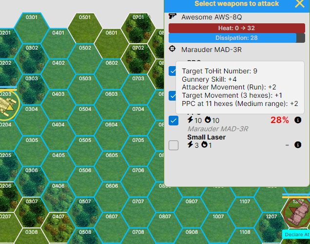

# MakaMek

A cross-platform implementation of turn-based tabletop tactics BattleTech, built with .NET 10 and AvaloniaUI.

## Overview

MakaMek is an open-source tactical combat game featuring giant walking war machines. The game is inspired by another computer implementation of BattleTech called [MegaMek](https://megamek.org/) but focusing on simplicity and accessibility for all players. We aim to keep gameplay simple and prioritize a mobile-first and web-first user experience.



## Implementation Phases
### Phase 0. Game foundation ✅
Complete as of v0.46.5. Allows to complete games locally and over the LAN.
- [MVP Product Requirements Document (PRD)](docs/MakaMek-MVP-PRD.md) - Detailed requirements and specifications for the Minimum Viable Product
- [MVP Gap Analysis](docs/MakaMek-MVP-Gap-Analysis(0.42.27).md) - Current implementation status against MVP requirements (as of v0.42.27)

#### Implemented
- [Client-Server app architecture](https://github.com/anton-makarevich/MakaMek/wiki/Game-(Protocol)-High-Level-Architecture) with RX communication for local play
- LAN multiplayer with SignalR (only Desktop app can host the game, mobile clients could connect, WEB can neither host nor connect)
- Single-player combat with up to 4 players on a single device
- Complete Turn flow implementation with all major phases including initiative, movement, attack declaration and resolution, heat and end phase
- Critical hits, aimed shots, destruction of units, locations and components
- Optional rule where flamers apply both damage and heat to the targets  
- Basic pilots implementation, unconsciousness, piloting skill rolls and falling
- Heat effects, shutdown, ammo explosion, restart, pilot damage and to hit modifiers
- Hex map generator (and previewer) with the simplest terrain types (clear, light and heavy wood) ([MegaMek](https://megamek.org/)'s assets) without levels 
- Cross-platform support (Windows, Linux, macOS, Web, Android, iOS)
- Prototype UI built with AvaloniaUI
- Importing mechs defined in MegaMek's MTF format (Level 1 equipment only), 173 mech variants are supported at the moment

### Phase 1. Bot framework 🚧
In progress (v 0.47.0 +). Combat against AI opponents
- [Bot Player System - Product Requirements Document (PRD)](docs/architecture/bot-player-system-prd.md) - Detailed requirements and specifications for the Bot Player System
- [Bot Player System - Implementation Roadmap](docs/architecture/bot-player-system-implementation-roadmap.md) - High-level plan for implementing the bot player system

#### Implemented
- Bot player framework with a decision engine for each game phase
- Basic movement and weapon targeting decisions
- Tactical evaluation for movement and weapon decisions
- Basic end phase decisions (shutdown/restart decisions, etc.)
- Considering heat and ammo rounds for weapon selection

### Future Phases
- Support of map Levels and extended terrain types
- Support of advanced tech rules (Clan, LosTech equipment and more)
- Support for vehicles, battle armor and infantry
- Multiplayer over the Internet (WebSockets/SignalR)
- Tools for creating and managing custom units and maps, compatible with common community data formats
- Monogame version with 3D graphics and possible VR/AR support

## Technology Stack

- .NET 10
- AvaloniaUI for cross-platform UI
- xUnit for testing

## Project Structure

```
MakaMek/
├── src/
│   ├── MakaMek.Core/         # Core game engine and logic
│   ├── MakaMek.Presentation/ # Presentation layer (ViewModels and UI states)
│   ├── MakaMek.Avalonia/     # UI implementation with AvaloniaUI
│   ├── MakaMek.Bots/         # Bot framework 
│   └── MakaMek.Tools/        # Tools and utilities
├── tests/                    # Unit tests
├── data/                     # Data files (e.g., unit definitions)
└── docs/                     # Documentation (also synced to GitHub Wiki)
```

### Project Status

| Component                  | Build Status                                                                                                                                                                                            | Package/Download                                                                                                                                                                                                                                                                                                                                                                                                                                                                                                                                                                                                                                                                                       |
|----------------------------|---------------------------------------------------------------------------------------------------------------------------------------------------------------------------------------------------------|--------------------------------------------------------------------------------------------------------------------------------------------------------------------------------------------------------------------------------------------------------------------------------------------------------------------------------------------------------------------------------------------------------------------------------------------------------------------------------------------------------------------------------------------------------------------------------------------------------------------------------------------------------------------------------------------------------|
| **Test Coverage (non-ui)** | [](https://codecov.io/github/anton-makarevich/MakaMek)                                                   |                                                                                                                                                                                                                                                                                                                                                                                                                                                                                                                                                                                                                                                                                                        |
| **MakaMek.Core**           | [](https://github.com/anton-makarevich/MakaMek/actions/workflows/core.yml)                                    | [](https://www.nuget.org/packages/Sanet.MakaMek.Core)                                                                                                                                                                                                                                                                                                                                                                                                                                                                                                                                                                 |
| **MakaMek.Presentation**   | [](https://github.com/anton-makarevich/MakaMek/actions/workflows/presentation.yml)                    | [](https://www.nuget.org/packages/Sanet.MakaMek.Presentation)                                                                                                                                                                                                                                                                                                                                                                                                                                                                                                                                                 |
| **MakaMek.Avalonia**       | [](https://github.com/anton-makarevich/MakaMek/actions/workflows/avalonia.yml)                            | [](https://www.nuget.org/packages/Sanet.MakaMek.Avalonia)                                                                                                                                                                                                                                                                                                                                                                                                                                                                                                                                                         |
| **Web Version (WASM)**     | [](https://github.com/anton-makarevich/MakaMek/actions/workflows/deploy-wasm.yml) | [](https://anton-makarevich.github.io/MakaMek/)                                                                                                                                                                                                                                                                                                                                                                                                                                                                                                                                                                     |
| **Android Version**        | [](https://github.com/anton-makarevich/MakaMek/actions/workflows/build-android.yml)      | [](https://github.com/anton-makarevich/MakaMek/actions/workflows/build-android.yml)                                                                                                                                                                                                                                                                                                                                                                                                                                                                                                                     |
| **macOS Version**          | [](https://github.com/anton-makarevich/MakaMek/actions/workflows/build-mac.yml)    | [](https://github.com/anton-makarevich/MakaMek/actions/workflows/build-mac.yml)                                                                                                                                                                                                                                                                                                                                                                                                                                                                                                                      |
| **Windows Version**        | [](https://github.com/anton-makarevich/MakaMek/actions/workflows/build-windows.yml)      | [](https://github.com/anton-makarevich/MakaMek/actions/workflows/build-windows.yml) |
| **Linux Version**          | [](https://github.com/anton-makarevich/MakaMek/actions/workflows/build-linux.yml)            | [](https://github.com/anton-makarevich/MakaMek/actions/workflows/build-linux.yml)                                                                                                                                                                                                                                                                                                                                                                                                                                                                                                                  |

> **Note:** iOS build requires a complex distribution process (App Store is not possible because of the licensing). While the platform is supported by the codebase, ipa is not available (yet?).
> Users can build and deploy to iOS devices from the source code.

## Development Setup
### Prerequisites

- .NET 10 SDK
- Your favorite IDE (Visual Studio, Rider or VS Code)

### Building

1. Clone the repository
2. Open `MakaMek.sln` in your IDE
3. Build the solution

## License

The source code for this project is licensed under the GNU General Public License v3.0 - see the [LICENSE](LICENSE) file for details.

### Art and Assets

Some art and assets used in this project—specifically unit and terrain images—are taken from the ([MegaMek Data Repository](https://github.com/MegaMek/mm-data/)). These materials are used as-is without any modifications and are distributed under the Creative Commons Attribution-NonCommercial-ShareAlike 4.0 International License ([https://creativecommons.org/licenses/by-nc-sa/4.0/](https://creativecommons.org/licenses/by-nc-sa/4.0/)).
The assets are located in the `data` folder and are supposed to be distributed separately as downloadable content.

If you have any concerns regarding the usage of any of these assets, please reach out to me at: anton.makarevich@gmail.com

## Acknowledgments

- Inspired by [MegaMek](https://megamek.org/)
- Thanks to the BattleTech community for their continued passion.

## Name Origin

The name MakaMek contains references to MegaMek, but also to my surname and the very first 'Mech ever created—the Mackie.

## Disclaimer

This is a fan-made project and is not affiliated with or endorsed by any commercial mech combat game properties. All trademarks belong to their respective owners.
This project is primarily a learning experience and a labor of love—developed for the enjoyment of the development process itself.
