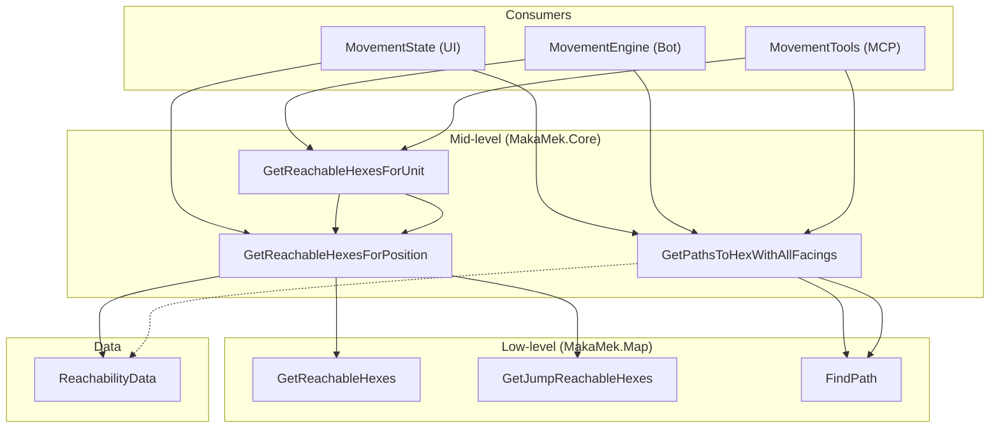

# Reachability API Analysis

## Implementation Status

| Issue | Status |
|-------|--------|
| 1.1 — Walk/jump return type mismatch | ✅ Fixed — both return `ReachableHexData` |
| 1.2 — `cost` computed but unused | ❌ Open |
| 1.3 — API split across assemblies | ❌ Open |
| 1.4 — Hardcoded `maxLevelChange` | ✅ Fixed — moved to `IUnit` model properties |
| 2.1 — `FindShortestPath`/`FindLongestPath` duplication | ✅ Fixed — unified into `FindPathCore(PathFindingMode)` |
| 2.2 — Two separate cache instances | ❌ Open |
| 2.3 — Consumer pattern repetition | ❌ Open |
| 3.1 — O(n) `Any()` lookups in `ReachabilityData` | ✅ Fixed — now `HashSet`-backed |
| 3.2 — `AllReachableCoordinates` allocates on every access | ✅ Fixed — now `Lazy<HashSet>` cached |
| 4.3 — Extract level-change rules | ✅ Fixed — as `IUnit` properties (better than const) |
| 4.5 — Remove `cost` from return type | ❌ Open |

---

## Overview

The reachability API spans three layers:

| Layer | File | Purpose |
|-------|------|---------|
| **Low-level** | [BattleMap.cs](../../src/MakaMek.Map/Models/BattleMap.cs) | `GetReachableHexes`, `GetJumpReachableHexes`, `FindPath` |
| **Mid-level** | [BattleMapExtensions.cs](file:///c:/Users/Anton/source/repos/MakaMek/src/MakaMek.Core/Models/Map/BattleMapExtensions.cs) | `GetReachableHexesForUnit`, `GetReachableHexesForPosition`, `GetPathsToHexWithAllFacings` |
| **Data** | [ReachabilityData.cs](file:///c:/Users/Anton/source/repos/MakaMek/src/MakaMek.Map/Data/ReachabilityData.cs) | Forward/backward reachable hex storage |



---

## 1. Inconsistencies

### 1.1 Return type mismatch between walk/run and jump reachability ✅ Fixed

> [!NOTE]
> Both methods now return `IEnumerable<ReachableHexData>`, a unified record struct with `Coordinates`, `Surface`, and `Cost`.

Both low-level methods now return the **same type** — [`IEnumerable<ReachableHexData>`](file:///c:/Users/Anton/source/repos/MakaMek/src/MakaMek.Map/Models/ReachableHexData.cs) — so the mid-level surface-patching hack has been removed:

### 1.2 `cost` field is computed but never consumed ❌ Open

`ReachableHexData` still includes `int Cost`, and [every caller discards it](file:///c:/Users/Anton/source/repos/MakaMek/src/MakaMek.Core/Models/Map/BattleMapExtensions.cs#L191):

```csharp
.Select(x => (coordinates: x.Coordinates, surface: x.Surface))   // cost dropped
```

No consumer uses the cost value.

### 1.3 `IBattleMap` interface vs extension methods — split API surface ❌ Open

The `IBattleMap` interface exposes low-level methods (`GetReachableHexes`, `GetJumpReachableHexes`, `FindPath`), but the *actually useful* methods (`GetReachableHexesForUnit`, `GetReachableHexesForPosition`, `GetPathsToHexWithAllFacings`) live as extension methods in a different assembly (`MakaMek.Core`).

This means:
- The interface declares methods nobody calls directly except the extensions
- The extensions are in `Core` but the data types (`ReachabilityData`) are in `Map.Data` — a dependency inversion oddity
- You cannot mock the high-level API for testing without also mocking the low-level methods

### 1.4 Hardcoded BattleMech-specific rules in generic code ✅ Fixed

> [!NOTE]
> Values moved to `IUnit.MaxLevelChangeForward` / `MaxLevelChangeBackward` model properties, eliminating the 4-place duplication.

The hardcoded `maxLevelChange: 2` / `maxLevelChange: 0` have been removed from the generic extension code. The values are now declared as virtual properties on `Unit` (defaults `0`/`0`) with overrides on `Mech` (`2`/`0`). The extension methods accept parameters threaded from `unit.MaxLevelChangeForward` / `unit.MaxLevelChangeBackward`.

---

## 2. Redundancies

### 2.1 Massive code duplication between `FindShortestPath` and `FindLongestPath` ✅ Fixed

`FindShortestPath` and `FindLongestPath` have been unified into a single [`FindPathCore(PathFindingMode mode, …)`](file:///c:/Users/Anton/source/repos/MakaMek/src/MakaMek.Map/Models/BattleMap.cs#L137-L291) method. The `PathFindingMode` enum (`Shortest`/`Longest`) controls the differing behaviors via branching inside the single method body.

### 2.2 Two separate `MovementPathCache` instances ❌ Open

```csharp
private readonly MovementPathCache _movementPathCache = new();
private readonly MovementPathCache _movementLongPathCache = new();
```

The remaining split is the two cache instances. With `FindPathCore(PathFindingMode)` already in place, this could become a single cache keyed by `PathFindingMode`.

### 2.3 Reachability is recomputed in `GetPathsToHexWithAllFacings` callers ❌ Open

All three consumers follow the exact same pattern:

`GetPathsToHexWithAllFacings` uses `ReachabilityData` only to check `IsForwardReachable` / `IsBackwardReachable`, which just scans a `List` via `.Any()`. This is O(n) per call on an uncached list.

---

## 3. Performance Issues in `ReachabilityData`

### 3.1 O(n) lookups on every query ✅ Fixed

```csharp
// Old: O(n) linear scans
public bool IsHexReachable(HexCoordinates hex) =>
    ForwardReachableHexes.Any(x => x.coordinates == hex) || 
    BackwardReachableHexes.Any(x => x.coordinates == hex);

// Fixed: O(1) HashSet lookup
public bool IsHexReachable(HexCoordinates hex) => _allReachableCoordinates.Value.Contains(hex);
```

Lookups are now `HashSet`-backed via `Lazy<HashSet<HexCoordinates>>` — O(1) instead of O(n).

### 3.2 `AllReachableCoordinates` recomputed on every access ✅ Fixed

```csharp
// Old: new HashSet allocated on every access
public IReadOnlySet<HexCoordinates> AllReachableCoordinates => 
    AllReachableHexes.Select(x => x.coordinates).ToHashSet();

// Fixed: Lazy<HashSet> — computed once, cached
public IReadOnlySet<HexCoordinates> AllReachableCoordinates => _allReachableCoordinates.Value;
```

Now backed by `Lazy<HashSet<HexCoordinates>>`, computed once and reused.

---

## 4. Simplification Opportunities

### 4.1 Unify `FindShortestPath` / `FindLongestPath` ✅ Done

Extract shared logic into a single method with a strategy parameter or delegate for the differing behaviors (priority, visit-check, result selection). This would eliminate ~100 lines of duplication.

### 4.2 Unify `GetReachableHexes` and `GetJumpReachableHexes` return types ✅ Done

Both methods now return `IEnumerable<ReachableHexData>`. This:
- Removed the surface patching in `GetReachableHexesForPosition`
- Allows a single code path for all movement types
- Potentially allows removing the `if (movementType == Jump)` branch entirely

### 4.3 Extract hardcoded level-change rules ✅ Done

Extracted as `IUnit.MaxLevelChangeForward` / `MaxLevelChangeBackward` model properties — better than standalone constants since it allows per-unit-type customization.

### 4.4 Cache lookup structures in `ReachabilityData` ✅ Done

Add `Lazy<HashSet>` backing for `IsForwardReachable` / `IsBackwardReachable` / `AllReachableCoordinates` to avoid linear scans and repeated allocations.

### 4.5 Consider removing `cost` from `GetReachableHexes` return type ❌ Open

Since no consumer uses it, removing it simplifies the API. If cost is needed in the future, it can be reintroduced or computed on demand.

---

## Summary Table

| # | Category | Issue | Severity | Status |
|---|----------|-------|----------|--------|
| 1.1 | Inconsistency | Walk vs jump return types (surface info) | Medium | ✅ Fixed |
| 1.2 | Inconsistency | `cost` computed but never used | Low | ❌ Open |
| 1.3 | Inconsistency | API split across interface + extensions in different assemblies | Medium | ❌ Open |
| 1.4 | Inconsistency | Hardcoded BattleMech rules in generic code (4 places) | Medium | ✅ Fixed |
| 2.1 | Redundancy | ~90% duplicate code in shortest vs longest pathfinding | High | ✅ Fixed |
| 2.2 | Redundancy | Two identical cache instances | Low | ❌ Open |
| 2.3 | Redundancy | Same consumer pattern repeated 3 times | Low | ❌ Open |
| 3.1 | Performance | O(n) linear scans in `ReachabilityData` lookups | Medium | ✅ Fixed |
| 3.2 | Performance | `AllReachableCoordinates` allocates on every access | Medium | ✅ Fixed |
