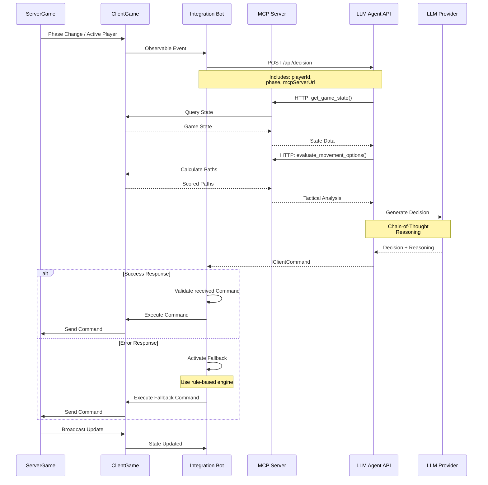
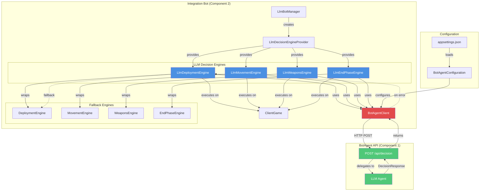

# LLM-Powered Bot System for MakaMek
## Architecture Design & Product Requirements Document

**Version:** 2.0
**Date:** 2026-01-13
**Status:** Design Proposal

---

## Executive Summary

This document presents a comprehensive design for integrating Large Language Model (LLM) powered bots into the MakaMek BattleTech game system. The solution leverages Microsoft Agent Framework for intelligent decision-making and Model Context Protocol (MCP) for seamless game integration, while maintaining compatibility with the existing bot infrastructure.

### Key Benefits

- **Advanced Tactical Reasoning**: LLM agents can analyze complex tactical situations with human-like strategic thinking
- **Adaptive Gameplay**: Agents learn and adapt strategies based on game context
- **Explainable Decisions**: LLM agents can provide reasoning for their tactical choices
- **Scalable Architecture**: Support for multiple concurrent LLM bot players
- **Graceful Degradation**: Fallback to rule-based engines ensures reliability
- **Extensible Design**: Easy to add new capabilities and improve agent performance
- **Containerized Deployment**: Docker-based deployment for easy orchestration and scaling

### High-Level Architecture

The system consists of two containerized applications:

1. **LLM Agent Container** - ASP.NET Core Web API application using Microsoft Agent Framework with 4 specialized agents: Deployment, Movement, Weapon Attack, and End-Phase
2. **Integration Bot Container** - ASP.NET Core application hosting both the MCP Server and Integration Bot logic, connecting to MakaMek ServerGame

---

## Table of Contents

1. [Current Architecture Analysis](#current-architecture-analysis)
2. [LLM Bot System Design](#llm-bot-system-design)
3. [Component Specifications](#component-specifications)
4. [MCP API Specification](#mcp-api-specification)
5. [Agent Design](#agent-design)
6. [Integration Patterns](#integration-patterns)
7. [Deployment Architecture](#deployment-architecture)
8. [Implementation Roadmap](#implementation-roadmap)
9. [Technical Specifications](#technical-specifications)
10. [Operational Considerations](#operational-considerations)
11. [Appendices](#appendices)

---

## 1. Current Architecture Analysis

### 1.1 Server-Client Architecture

MakaMek uses a distributed architecture with clear separation between authoritative server and client game instances:

#### ServerGame
- **Location**: `src/MakaMek.Core/Models/Game/ServerGame.cs`
- **Responsibilities**:
    - Maintains authoritative game state
    - Validates and processes client commands
    - Manages phase transitions via `IPhaseManager`
    - Broadcasts state changes to all clients
    - Handles dice rolling and random events
    - Enforces game rules

#### ClientGame
- **Location**: `src/MakaMek.Core/Models/Game/ClientGame.cs`
- **Responsibilities**:
    - Maintains local replica of game state
    - Sends player commands to server
    - Receives and applies server updates
    - Provides reactive observables for state changes
    - Manages command acknowledgment and idempotency
    - Supports multiple local players (including bots)

#### Command Flow
```
Client → IClientCommand → CommandPublisher → Transport → Server
Server → Validation → Processing → IGameCommand → Broadcast → All Clients
```

**Key Insight**: One ClientGame instance serves one or more local players (human and bot).

### 1.2 Bot System Overview

#### Current Bot Architecture
- **Bot Class**: `src/MakaMek.Bots/Models/Bot.cs`
    - Observes ClientGame via reactive subscriptions
    - Monitors `PhaseChanges`, `PhaseStepChanges`, and `Commands` observables
    - Triggers decision-making when bot becomes active player
    - Delegates decisions to phase-specific engines

#### Decision Engines
- **Interface**: `IBotDecisionEngine` - `src/MakaMek.Bots/Models/DecisionEngines/IBotDecisionEngine.cs`
- **Implementations**:
    - `DeploymentEngine` - Selects deployment hexes and facing
    - `MovementEngine` - Evaluates movement paths using tactical scoring
    - `WeaponsEngine` - Selects targets and weapon configurations
    - `EndPhaseEngine` - Manages heat, shutdown, and startup decisions

#### Tactical Evaluator
- **Location**: `src/MakaMek.Bots/Models/DecisionEngines/TacticalEvaluator.cs`
- **Capabilities**:
    - Evaluates movement paths with offensive/defensive scoring
    - Calculates hit probabilities using `ToHitCalculator`
    - Scores weapon configurations and target priorities
    - Considers terrain, line of sight, and range
    - Caches evaluations for performance (internal to TacticalEvaluator)

### 1.3 Game Phases

MakaMek implements the following game phases (from `PhaseNames.cs`):

1. **Start** - Lobby and player joining
2. **Deployment** - Unit placement on map *(requires LLM decision)*
3. **Initiative** - Turn order determination
4. **Movement** - Unit movement and positioning *(requires LLM decision)*
5. **WeaponsAttack** - Weapon target declaration *(requires LLM decision)*
6. **WeaponAttackResolution** - Attack resolution and damage
7. **PhysicalAttack** - Melee combat (not yet implemented)
8. **Heat** - Heat management and effects
9. **End** - Turn cleanup and phase cycling *(requires LLM decision)*

Phase transitions are managed by `BattleTechPhaseManager` which implements the standard BattleTech turn sequence.

**Note**: Only 4 phases (Deployment, Movement, WeaponsAttack, End) require bot decision-making at this time.

### 1.4 Command System

#### Command Types
- **IClientCommand** - Commands from clients to server
    - Include `IdempotencyKey` for duplicate detection (handled internally by ClientGame)
    - Examples: `DeployUnitCommand`, `MoveUnitCommand`, `WeaponAttackDeclarationCommand`

- **IGameCommand** - Server broadcast commands
    - Examples: `ChangePhaseCommand`, `TurnIncrementedCommand`, `SetBattleMapCommand`

#### Transport Layer
- **CommandPublisher** - Pub/sub pattern for command distribution
- **CommandTransportAdapter** - Serialization and transport abstraction
- **ITransportPublisher** - Network transport interface (supports local and network)

---

## 2. LLM Bot System Design

### 2.1 Architecture Overview

The LLM bot system introduces two containerized applications that integrate with the existing MakaMek architecture:

#### Architecture Diagram

```text
┌─────────────────────────────────────────────────────────────┐
│                    MakaMek ServerGame                       │
│                    (Authoritative State)                    │
└───────────────────────┬─────────────────────────────────────┘
                        │ Commands & State Updates
                        │ (via Transport)
        ┌───────────────┼───────────────┬─────────────────┐
        │               │               │                 │
┌───────▼────────┐ ┌────▼───────┐ ┌─────▼──────┐   ┌──────▼─────┐
│ Integration    │ │Integration │ │Integration │   │Integration │
│ Bot Container 1│ │Bot Cont. 2 │ │Bot Cont. 3 │...│Bot Cont. N │
│                │ │            │ │            │   │            │
│ ┌────────────┐ │ │            │ │            │   │            │
│ │ClientGame  │ │ │Each container hosts:      │   │            │
│ │ (Player 1) │ │ │- ClientGame instance      │   │            │
│ └─────┬──────┘ │ │- MCP Server               │   │            │
│       │        │ │- Integration Bot Logic    │   │            │
│ ┌─────▼──────┐ │ │                           │   │            │
│ │Integration │ │ │            │ │            │   │            │
│ │Bot Logic   │ │ │            │ │            │   │            │
│ └─────┬──────┘ │ │            │ │            │   │            │
│       │        │ │            │ │            │   │            │
│ ┌─────▼──────┐ │ │            │ │            │   │            │
│ │MCP Server  │ │ │            │ │            │   │            │
│ │HTTP/SSE    │ │ │            │ │            │   │            │
│ └─────┬──────┘ │ │            │ │            │   │            │
└───────┼────────┘ └───┬────────┘ └───┬────────┘   └───┬────────┘
        │              │              │                │
        │ HTTP Requests│              │                │
        └──────────────┴─┬────────────┴────────────────┘
                         │
                         │
              ┌──────────▼───────────┐
              │ LLM Agent Container  │
              │ (Shared Instance)    │
              │                      │
              │ ┌──────────────────┐ │
              │ │  ASP.NET Core    │ │
              │ │  Web API         │ │
              │ └────────┬─────────┘ │
              │          │           │
              │ ┌────────▼─────────┐ │
              │ │  Orchestrator    │ │
              │ └────────┬─────────┘ │
              │          │           │
              │    ┌─────┴─────┐     │
              │    ▼     ▼     ▼     │
              │  ┌───┐ ┌───┐ ┌───┐   │
              │  │Dep│ │Mov│ │Wpn│   │
              │  │Agt│ │Agt│ │Agt│   │
              │  └─┬─┘ └─┬─┘ └─┬─┘   │
              │    └─────┼─────┘     │
              │          │           │
              │   MCP Client         │
              └──────────┼───────────┘
                         │
                         │ HTTP/SSE
                         │ (calls back to
                         │  bot's MCP Server)
                         ▼
              ┌──────────────────────┐
              │  LLM Provider        │
              │  (OpenAI/Anthropic)  │
              └──────────────────────┘
```

**Key Architectural Points**:

1. **Multiple Bot Instances**: Each LLM bot runs in its own Integration Bot container with its own ClientGame instance
2. **Shared Agent Service**: All bots make stateless HTTP requests to a single shared LLM Agent container
3. **Embedded MCP Server**: Each Integration Bot container hosts its own MCP Server endpoint
4. **Stateless Communication**: Agent requests are stateless; no context preserved between turns or phases

### 2.2 Component Responsibilities

#### Container 1: LLM Agent Application
**Type**: ASP.NET Core Web API (.NET 10)
**Technology**: Microsoft Agent Framework + LLM SDKs
**Port**: 5000 (configurable)

**Responsibilities**:
- Host 4 specialized agents: Deployment, Movement, Weapon Attack, and End-Phase
- Expose REST API for decision requests
- Orchestrate agent selection based on game phase
- Communicate with LLM providers (OpenAI, Anthropic, Azure OpenAI, etc.)
- Use MCP client to query bot's MCP Server for game state
- Generate tactical decisions with reasoning
- Return structured decision responses

**Key Features**:
- Multi-agent architecture with phase-specific specialization
- Chain-of-thought reasoning for complex decisions
- Structured output generation for reliable parsing
- Configurable LLM provider and model selection
- Health check endpoint for monitoring
- Stateless request handling (no session state)

**API Endpoints**:
- `POST /api/decision` - Request tactical decision
- `GET /api/health` - Health check

#### Container 2: Integration Bot Application
**Type**: ASP.NET Core Application (.NET 10)
**Technology**: MCP SDK + MakaMek.Core + Reactive Extensions
**Port**: 5001 (configurable, one per bot instance)

**Responsibilities**:
- Host MCP Server (HTTP/SSE endpoint)
- Host Integration Bot background service
- Maintain ClientGame instance connection to ServerGame
- Observe game state changes via ClientGame observables
- Trigger LLM agent requests based on phase and context
- Translate LLM responses to game commands
- Execute commands via ClientGame
- Provide fallback to rule-based decision engines
- Expose game state and tactical analysis via MCP tools

**Key Features**:
- Embedded MCP Server for game state queries
- Comprehensive tool catalog for tactical analysis
- Seamless integration with existing bot infrastructure
- Mandatory fallback to rule-based engines on error
- Real-time game state synchronization
- Structured error responses

**Endpoints**:
- MCP Server: `/mcp` (HTTP/SSE)
- Health check: `/health`

### 2.3 Data Flow

#### Decision-Making Flow



**Flow Steps**:

1. **Game State Change**
    - ServerGame broadcasts phase change or active player change
    - ClientGame receives update and publishes to observables

2. **Trigger Detection**
    - Integration Bot detects relevant change via subscription
    - Determines if LLM decision is needed based on phase and player

3. **Decision Request**
    - Integration Bot sends HTTP POST to Agent API
    - Request includes: playerId, phase, mcpServerUrl (for callback)
    - Request is stateless - no preserved context

4. **Agent Processing**
    - Agent Orchestrator selects appropriate specialized agent
    - Agent makes MCP tool calls to bot's MCP Server as needed
    - Agent generates decision with reasoning using LLM
    - Agent returns corresponding IClientCommand

5. **Response Handling**
    - Integration Bot validates decision against game rules
    - If valid: executes IClientCommand directly
    - If error: activates mandatory fallback engine

6. **Command Execution**
    - Integration Bot sends command via ClientGame
    - ServerGame validates, processes, and broadcasts
    - All clients receive updated game state

### 2.4 Technology Stack

#### Container 1: LLM Agent Application
- **Framework**: .NET 10
- **Web Framework**: ASP.NET Core Web API
- **Agent Framework**: [Microsoft Agent Framework](https://github.com/microsoft/agent-framework)
- **LLM SDKs**:
    - OpenAI .NET SDK
    - Anthropic .NET SDK
    - Azure.AI.OpenAI
- **MCP Client**: ModelContextProtocol.SDK
- **Configuration**: Microsoft.Extensions.Configuration
- **Logging**: Microsoft.Extensions.Logging
- **Dependency Injection**: Microsoft.Extensions.DependencyInjection

#### Container 2: Integration Bot Application
- **Framework**: .NET 10
- **Web Framework**: ASP.NET Core (for MCP Server hosting)
- **Dependencies**: MakaMek.Core, MakaMek.Bots
- **MCP SDK**: ModelContextProtocol.SDK (C# implementation)
- **Reactive**: System.Reactive
- **HTTP Client**: System.Net.Http (for Agent API calls)
- **Serialization**: System.Text.Json
- **Caching**: Microsoft.Extensions.Caching.Memory
- **Background Services**: Microsoft.Extensions.Hosting

---

## 3. Component Specifications

### 3.1 Container 1: LLM Agent Application

#### 3.1.1 Project Structure

```
MakaMek.LlmAgent/
├── Program.cs                          # Application entry point
├── Controllers/
│   └── DecisionController.cs           # REST API endpoints
├── Configuration/
│   ├── AgentConfiguration.cs           # Agent settings
│   └── LlmProviderConfiguration.cs     # LLM provider settings
├── Orchestration/
│   └── AgentOrchestrator.cs            # Agent selection and coordination
├── Agents/
│   ├── BaseAgent.cs                    # Base class for all agents
│   ├── DeploymentAgent.cs              # Deployment phase decisions
│   ├── MovementAgent.cs                # Movement phase decisions
│   ├── WeaponsAttackAgent.cs           # Weapons attack phase decisions
│   └── EndPhaseAgent.cs                # End phase decisions (Heat)
├── Prompts/
│   ├── SystemPrompts.cs                # System prompts for each agent
│   ├── DeploymentPrompts.cs            # Deployment-specific prompts
│   ├── MovementPrompts.cs              # Movement-specific prompts
│   ├── WeaponsAttackPrompts.cs         # Weapons attack prompts
│   └── EndPhasePrompts.cs              # End phase prompts
├── Services/
│   ├── ILlmProvider.cs                 # LLM provider abstraction
│   ├── OpenAIProvider.cs               # OpenAI implementation
│   ├── AnthropicProvider.cs            # Anthropic implementation
│   └── McpClientService.cs             # MCP client for tool calls
└── Models/
    ├── DecisionRequest.cs              # Request from Integration Bot
    ├── DecisionResponse.cs             # Response to Integration Bot
    └── GameContext.cs                  # Game state context
```

#### 3.1.2 API Contract

**Decision Request**:
```json
{
  "playerId": "guid",
  "phase": "Movement",
  "mcpServerUrl": "http://bot-container:5001/mcp",
  "timeout": 30000
}
```

**Agent Response (Success - MoveUnitCommand)**:
```json
{
  "success": true,
  "commandType": "<type>",
  "command": {
   ...
  },
  "reasoning": "Walking to hex (12,6) provides optimal firing position while maintaining cover..."
}
```

**Agent Response (Error)**:
```json
{
  "success": false,
  "errorType": "AGENT_CANNOT_DECIDE" | "LLM_TIMEOUT" | "INVALID_GAME_STATE",
  "errorMessage": "Detailed error description",
  "fallbackRequired": true
}
```

**Supported IClientCommand Types**:
- `DeployUnitCommand` - Unit deployment with position and facing
- `MoveUnitCommand` - Unit movement with path and movement type
- `WeaponAttackDeclarationCommand` - Weapon target declaration
- `WeaponConfigurationCommand` - to rotate torso
- `Startup/ShutdownUnitCcommand` - to manage unit state during end phase
- `EndPhaseCommand` - End phase actions (shutdown, startup, none)

#### 3.1.3 Agent Specifications

##### DeploymentAgent
**Purpose**: Select optimal deployment position and facing for units

**System Prompt Template**:
```
You are a BattleTech tactical AI specializing in unit deployment. Your goal is to
select deployment positions that maximize tactical advantage while considering:
- Distance to enemy units
- Terrain cover and elevation
- Line of sight to objectives
- Support from friendly units
- Escape routes and maneuverability

Analyze the available deployment zones and select the best position and facing.
```

**Available MCP Tools**:
- `get_deployment_zones` - Get valid deployment hexes
- `get_map_info` - Analyze terrain
- `get_game_state` - See enemy positions

**Decision Output Fields**:
- `action`: "deploy"
- `unitId`: string (GUID)
- `hexCoordinates`: {q, r}
- `facing`: string (Top/TopRight/BottomRight/Bottom/BottomLeft/TopLeft)
- `reasoning`: string

##### MovementAgent
**Purpose**: Evaluate movement options and select optimal path

**System Prompt Template**:
```
You are a BattleTech tactical AI specializing in mech movement. Your goal is to
position units for maximum tactical advantage while minimizing risk. Consider:
- Offensive positioning (weapon range, line of sight to enemies)
- Defensive positioning (cover, minimizing rear arc exposure)
- Heat management (walking vs running vs jumping)
- Terrain effects (elevation, woods, water)
- Piloting skill roll requirements

Use the tactical evaluation tools to score movement options and select the best path.
```

**Available MCP Tools**:
- `evaluate_movement_options` - Get scored movement paths
- `get_game_state` - Current tactical situation
- `get_unit_details` - Unit capabilities

**Decision Output Fields**:
- `action`: "move"
- `unitId`: string (GUID)
- `movementPath`: array of {q, r}
- `movementType`: "Walk" | "Run" | "Jump"
- `reasoning`: string

##### WeaponsAttackAgent
**Purpose**: Select targets and weapon configurations for maximum damage

**System Prompt Template**:
```
You are a BattleTech tactical AI specializing in weapons targeting. Your goal is to
maximize damage output while managing heat and ammunition. Consider:
- Target priority (damaged units, high-value targets)
- Hit probability vs potential damage
- Heat generation and shutdown risk
- Ammunition conservation
- Weapon configurations (torso twist, aimed shots)

Analyze available targets and select the optimal weapon configuration.
```

**Available MCP Tools**:
- `evaluate_weapon_targets` - Get scored target options
- `calculate_hit_probability` - Estimate hit chance
- `get_unit_details` - Analyze target damage state

**Decision Output Fields**:
- `action`: "attack"
- `attackerUnitId`: string (GUID)
- `targetUnitId`: string (GUID)
- `weaponIds`: array of string (GUIDs)
- `configuration`: object (optional, e.g., {type: "TorsoRotation", value: 1})
- `reasoning`: string

##### EndPhaseAgent 
**Purpose**: Manage shutdown and startup decisions, end turn

**System Prompt Template**:
```
You are a BattleTech tactical AI specializing in end phase decisions. Your goal is to
keep units operational while avoiding catastrophic heat effects. Consider:
- Current heat level and dissipation rate
- Ammo explosion risk at high heat
- Shutdown vs continued operation trade-offs
- Restart probability for shutdown units
- Next turn tactical requirements

Make decisions about shutting down overheated units or restarting shutdown units.
```

**Available MCP Tools**:
- `get_unit_details` - Heat and shutdown status
- `get_game_state` - Tactical situation

**Decision Output Fields**:
- `action`: "shutdown" | "startup" | "none"
- `unitId`: string (GUID)
- `reasoning`: string

#### 3.1.4 LLM Provider Configuration

```json
{
  "LlmProvider": {
    "Type": "OpenAI",
    "Model": "gpt-4o",
    "Temperature": 0.7,
    "MaxTokens": 2000,
    "Timeout": 30000,
    "ApiKey": "${OPENAI_API_KEY}"
  },
  "Agent": {
    "EnableChainOfThought": true,
    "MaxMcpToolCalls": 10
  }
}
```

**Supported Providers**:
- **OpenAI**: gpt-4o, gpt-4-turbo, gpt-4, gpt-3.5-turbo
- **Anthropic**: claude-3-5-sonnet-20241022, claude-3-opus-20240229
- **Azure OpenAI**: Any deployed model

### 3.2 Container 2: Integration Bot Application

#### 3.2.1 Project Structure

```
MakaMek.Bots.Llm/
├── Program.cs                          # ASP.NET Core entry point
├── Controllers/
│   └── HealthController.cs             # Health check endpoint
├── Services/
│   ├── IntegrationBotService.cs        # Background service (IHostedService)
│   ├── LlmAgentClient.cs               # HTTP client for Agent API
│   └── FallbackDecisionEngine.cs       # Rule-based fallback (mandatory)
├── Mcp/
│   ├── McpServer.cs                    # MCP server implementation
│   ├── McpController.cs                # MCP HTTP/SSE endpoint
│   ├── Tools/
│   │   ├── GameStateTools.cs           # Game state query tools
│   │   ├── TacticalAnalysisTools.cs    # Tactical evaluation tools
│   │   └── ToolRegistry.cs             # Tool registration
│   ├── Resources/
│   │   ├── GameStateResource.cs        # Current game state
│   │   ├── UnitResource.cs             # Unit details
│   │   └── MapResource.cs              # Map information
│   └── Models/
│       ├── ToolDefinition.cs           # Tool metadata
│       ├── ToolRequest.cs              # Tool invocation request
│       └── ToolResponse.cs             # Tool invocation response
├── DecisionEngines/
│   ├── LlmDeploymentEngine.cs          # Implements IBotDecisionEngine
│   ├── LlmMovementEngine.cs            # Implements IBotDecisionEngine
│   ├── LlmWeaponsAttackEngine.cs       # Implements IBotDecisionEngine
│   └── LlmEndPhaseEngine.cs            # Implements IBotDecisionEngine
├── Models/
│   ├── LlmBot.cs                       # Extends Bot class
│   └── BotConfiguration.cs             # Bot configuration
└── Configuration/
    └── appsettings.json                # Application settings
```

#### 3.2.2 Integration Bot Service

```csharp
public class IntegrationBotService : BackgroundService
{
    private readonly IClientGame _clientGame;
    private readonly LlmAgentClient _agentClient;
    private readonly FallbackDecisionEngine _fallbackEngine;
    private readonly ILogger<IntegrationBotService> _logger;
    
    protected override async Task ExecuteAsync(CancellationToken stoppingToken)
    {
        // Subscribe to game observables
        _clientGame.PhaseChanges.Subscribe(OnPhaseChanged);
        _clientGame.PhaseStepChanges.Subscribe(OnPhaseStepChanged);
        
        // Keep service running
        await Task.Delay(Timeout.Infinite, stoppingToken);
    }
    
    private async void OnPhaseStepChanged(PhaseStep phaseStep)
    {
        if (phaseStep?.ActivePlayer.Id == _botPlayerId)
        {
            await MakeDecision(phaseStep);
        }
    }
    
    private async Task MakeDecision(PhaseStep phaseStep)
    {
        try
        {
            var response = await _agentClient.RequestDecision(
                _botPlayerId, 
                phaseStep.Phase,
                GetMcpServerUrl() //self host url basically, including port
            );
            
            if (response.Success)
            {
                await ExecuteDecision(response);
            }
            else
            {
                _logger.LogWarning("Agent error: {Error}", response.ErrorMessage);
                await UseFallback(phaseStep);
            }
        }
        catch (Exception ex)
        {
            _logger.LogError(ex, "Decision request failed");
            await UseFallback(phaseStep);
        }
    }
}
```

#### 3.2.3 MCP Server Tools

**Tool Catalog**:

1. **get_game_state** - Returns current game state
2. **get_unit_details** - Returns detailed unit information
3. **get_map_info** - Returns battle map and terrain
4. **get_deployment_zones** - Returns valid deployment hexes
5. **evaluate_movement_options** - Returns scored movement paths
6. **evaluate_weapon_targets** - Returns scored weapon targets
7. **calculate_hit_probability** - Calculates weapon hit chance
8. **get_tactical_situation** - Returns comprehensive tactical analysis

**Tool Response Format**:
```json
{
  "success": true,
  "data": { /* tool-specific data */ },
  "error": null
}
```

**Error Response Format**:
```json
{
  "success": false,
  "data": null,
  "error": {
    "code": "INVALID_UNIT_ID",
    "message": "Unit with ID 'xyz' not found"
  }
}
```

**Error Validation Strategy**:
- Basic parameter validation (null checks, type checks)
- Game state validation (unit exists, valid hex coordinates)
- Clear error messages for debugging
- No complex JSON schema validation (kept simple for POC)

#### 3.2.4 Fallback Engine (Mandatory)
Every LlmEngine should accept fallback engine in its constructor

**Fallback Activation Triggers**:
1. Agent returns error response
2. HTTP request to Agent fails or times out
3. Invalid decision response from Agent
4. Any unhandled exception in LLM pipeline

---

## 4. MCP API Specification

### 4.1 MCP Protocol Basics

**Transport**: HTTP/SSE (Server-Sent Events)
**Endpoint**: `/mcp`
**Content-Type**: `application/json`

**Request Format**:
```json
{
  "jsonrpc": "2.0",
  "method": "tools/call",
  "params": {
    "name": "get_game_state",
    "arguments": {}
  },
  "id": 1
}
```

**Response Format**:
```json
{
  "jsonrpc": "2.0",
  "result": {
    "content": [
      {
        "type": "text",
        "text": "{\"gameId\": \"...\", \"turn\": 3, ...}"
      }
    ]
  },
  "id": 1
}
```

### 4.2 Tool Definitions

#### get_game_state

```json
{
  "name": "get_game_state",
  "description": "Returns current game state including phase, turn, players, and units",
  "inputSchema": {
    "type": "object",
    "properties": {},
    "required": []
  }
}
```

**Response**:
```json
{
  "gameId": "guid",
  "turn": 3,
  "phase": "Movement",
  "activePlayer": {
    "id": "guid",
    "name": "Bot Player 1",
    "unitsToPlay": 2
  },
  "players": [...],
  "units": [...]
}
```

#### get_unit_details

```json
{
  "name": "get_unit_details",
  "description": "Returns detailed information about a specific unit",
  "inputSchema": {
    "type": "object",
    "properties": {
      "unitId": {"type": "string", "description": "GUID of the unit"}
    },
    "required": ["unitId"]
  }
}
```

**Response**:
```json
{
  "unitId": "guid",
  "name": "Atlas AS7-D",
  "position": {"q": 10, "r": 5, "facing": "North"},
  "armor": {...},
  "structure": {...},
  "weapons": [...],
  "heat": {"current": 12, "capacity": 30},
  "movement": {"walking": 3, "running": 5, "jumping": 0},
  "status": {"isProne": false, "isShutdown": false}
}
```

#### evaluate_movement_options

```json
{
  "name": "evaluate_movement_options",
  "description": "Evaluates all possible movement options for a unit and returns scored paths",
  "inputSchema": {
    "type": "object",
    "properties": {
      "unitId": {"type": "string", "description": "GUID of the unit"},
      "maxPaths": {"type": "integer", "description": "Maximum paths to return", "default": 10}
    },
    "required": ["unitId"]
  }
}
```

**Response**:
```json
{
  "paths": [
    {
      "destination": {"q": 12, "r": 8, "facing": "North"},
      "movementType": "Walk",
      "offensiveScore": 45.2,
      "defensiveScore": 12.3,
      "enemiesInRearArc": 0,
      "hexesTraveled": 3
    }
  ]
}
```

#### evaluate_weapon_targets

```json
{
  "name": "evaluate_weapon_targets",
  "description": "Evaluates potential weapon targets and returns scored options",
  "inputSchema": {
    "type": "object",
    "properties": {
      "attackerUnitId": {"type": "string"},
      "maxTargets": {"type": "integer", "default": 5}
    },
    "required": ["attackerUnitId"]
  }
}
```

**Response**:
```json
{
  "targets": [
    {
      "targetId": "guid",
      "configurations": [
        {
          "type": "TorsoRotation",
          "value": 1,
          "score": 38.5,
          "weapons": [
            {
              "weaponId": "guid",
              "name": "PPC",
              "hitProbability": 0.72,
              "damage": 10
            }
          ]
        }
      ]
    }
  ]
}
```

---

## 5. Agent Design

### 5.1 Agent Orchestrator

The Agent Orchestrator selects the appropriate specialized agent based on the game phase:

```csharp
public class AgentOrchestrator
{
    private readonly Dictionary<string, IAgent> _agents;
    
    public async Task<AgentResponse> ProcessDecision(DecisionRequest request)
    {
        var agent = request.Phase switch
        {
            "Deployment" => _agents["deployment"],
            "Movement" => _agents["movement"],
            "WeaponsAttack" => _agents["weapons"],
            "End" => _agents["endphase"],
            _ => throw new NotSupportedException($"Phase {request.Phase} not supported")
        };
        
        return await agent.MakeDecision(request);
    }
}
```

### 5.2 Agent Execution Flow

Each agent follows this execution pattern:

1. **Initialize MCP Client** with bot's MCP Server URL
2. **Query Game State** using appropriate MCP tools
3. **Generate Prompt** with game context and tactical considerations
4. **Call LLM** with structured output requirements
5. **Parse Response** and validate decision
6. **Return DecisionResponse** with success/error indication

### 5.3 Stateless Design

**Key Principle**: Each decision request is completely stateless.

- No conversation history preserved between requests
- No context carried over between turns or phases
- Agent queries all needed information via MCP tools
- Fresh LLM context for each decision

**Rationale**: Simplifies architecture, avoids context window limits, ensures each decision is based on current game state only.

---

## 6. Integration Patterns

### 6.1 Multi-Bot Deployment

For a game with 4 LLM bots:

```
ServerGame (1 instance)
    ↓
Integration Bot Container × 4 (one per bot)
    - Bot 1: Port 5001, ClientGame instance, MCP Server
    - Bot 2: Port 5002, ClientGame instance, MCP Server
    - Bot 3: Port 5003, ClientGame instance, MCP Server
    - Bot 4: Port 5004, ClientGame instance, MCP Server
    ↓
LLM Agent Container (1 shared instance)
    - Port 5000
    - Handles concurrent stateless requests from all bots
```

**Configuration Per Bot**:
```json
{
  "Bot": {
    "PlayerId": "bot-1-guid",
    "PlayerName": "LLM Bot 1",
    "McpServerPort": 5001
  },
  "Agent": {
    "ApiUrl": "http://llm-agent:5000"
  },
  "ServerGame": {
    "Url": "http://server:8080"
  }
}
```
Optionally should contain list of units to use

### 6.2 Command Translation

Decision responses are translated to game commands:
As all commands are simple records, the Agent returns a corresponding IClientCommand structure directly to simplify/eliminate mappings

### 6.3 Error Handling Flow

```csharp
private async Task HandleDecisionError(DecisionResponse response, PhaseStep phaseStep)
{
    _logger.LogWarning(
        "LLM decision failed: {ErrorType} - {Message}", 
        response.ErrorType, 
        response.ErrorMessage
    );
    
    // Record metrics
    _metrics.RecordFailure(response.ErrorType);
    
    // Activate mandatory fallback
    await _fallbackEngine.MakeDecision(_player, phaseStep.Phase);
}
```

---

## 7. Deployment Architecture

### 7.1 Docker Compose Configuration

```yaml
version: '3.8'

services:
  # LLM Agent Container (Shared)
  llm-agent:
    build:
      context: ./MakaMek.LlmAgent
      dockerfile: Dockerfile
    image: makamek/llm-agent:latest
    container_name: makamek-llm-agent
    ports:
      - "5000:5000"
    environment:
      - ASPNETCORE_ENVIRONMENT=Production
      - ASPNETCORE_URLS=http://+:5000
      - LlmProvider__Type=OpenAI
      - LlmProvider__Model=gpt-4o
      - LlmProvider__ApiKey=${OPENAI_API_KEY}
      - LlmProvider__Temperature=0.7
      - LlmProvider__MaxTokens=2000
      - LlmProvider__Timeout=30000
    healthcheck:
      test: ["CMD", "curl", "-f", "http://localhost:5000/health"]
      interval: 30s
      timeout: 10s
      retries: 3
    restart: unless-stopped
    networks:
      - makamek-network

  # Integration Bot 1
  integration-bot-1:
    build:
      context: ./MakaMek.Bots.Llm
      dockerfile: Dockerfile
    image: makamek/integration-bot:latest
    container_name: makamek-bot-1
    ports:
      - "5001:5001"
    environment:
      - ASPNETCORE_ENVIRONMENT=Production
      - ASPNETCORE_URLS=http://+:5001
      - Bot__PlayerId=${BOT_1_PLAYER_ID}
      - Bot__PlayerName=LLM Bot 1
      - Bot__McpServerPort=5001
      - Agent__ApiUrl=http://llm-agent:5000
      - ServerGame__Url=${SERVER_GAME_URL}
    depends_on:
      - llm-agent
    healthcheck:
      test: ["CMD", "curl", "-f", "http://localhost:5001/health"]
      interval: 30s
      timeout: 10s
      retries: 3
    restart: unless-stopped
    networks:
      - makamek-network

  # Integration Bot 2
  # add as many as needed based on the pattern

networks:
  makamek-network:
    driver: bridge
```

### 7.2 Environment Variables (.env file)

```bash
# LLM Provider Configuration
OPENAI_API_KEY=sk-your-api-key-here
```

### 7.3 Dockerfile Examples

**LLM Agent Dockerfile**:
```dockerfile
FROM mcr.microsoft.com/dotnet/aspnet:10.0 AS base
WORKDIR /app
EXPOSE 5000

FROM mcr.microsoft.com/dotnet/sdk:10.0 AS build
WORKDIR /src
COPY ["MakaMek.LlmAgent/MakaMek.LlmAgent.csproj", "MakaMek.LlmAgent/"]
RUN dotnet restore "MakaMek.LlmAgent/MakaMek.LlmAgent.csproj"
COPY . .
WORKDIR "/src/MakaMek.LlmAgent"
RUN dotnet build "MakaMek.LlmAgent.csproj" -c Release -o /app/build

FROM build AS publish
RUN dotnet publish "MakaMek.LlmAgent.csproj" -c Release -o /app/publish

FROM base AS final
WORKDIR /app
COPY --from=publish /app/publish .
ENTRYPOINT ["dotnet", "MakaMek.LlmAgent.dll"]
```

**Integration Bot Dockerfile**:
```dockerfile
FROM mcr.microsoft.com/dotnet/aspnet:10.0 AS base
WORKDIR /app
EXPOSE 5001

FROM mcr.microsoft.com/dotnet/sdk:10.0 AS build
WORKDIR /src
COPY ["MakaMek.Bots.Llm/MakaMek.Bots.Llm.csproj", "MakaMek.Bots.Llm/"]
COPY ["MakaMek.Core/MakaMek.Core.csproj", "MakaMek.Core/"]
COPY ["MakaMek.Bots/MakaMek.Bots.csproj", "MakaMek.Bots/"]
RUN dotnet restore "MakaMek.Bots.Llm/MakaMek.Bots.Llm.csproj"
COPY . .
WORKDIR "/src/MakaMek.Bots.Llm"
RUN dotnet build "MakaMek.Bots.Llm.csproj" -c Release -o /app/build

FROM build AS publish
RUN dotnet publish "MakaMek.Bots.Llm.csproj" -c Release -o /app/publish

FROM base AS final
WORKDIR /app
COPY --from=publish /app/publish .
ENTRYPOINT ["dotnet", "MakaMek.Bots.Llm.dll"]
```

### 7.4 Deployment Commands

```bash
# Build images
docker-compose build

# Start all containers
docker-compose up -d

# View logs
docker-compose logs -f llm-agent
docker-compose logs -f integration-bot-1

# Stop all containers
docker-compose down

# Rebuild and restart
docker-compose up -d --build
```

---

## 8. Implementation Roadmap

### Phase 1: Foundation (Weeks 1-2)
- Set up project structure for both containers
- Implement basic ASP.NET Core applications
- Create MCP Server with minimal tool set
- Implement Agent API with one agent (Movement)
- Basic docker-compose configuration
- End-to-end test with one bot

### Phase 2: Complete Agent Set (Weeks 3-4)
- Implement all 4 specialized agents
- Complete MCP tool catalog
- Implement mandatory fallback engines
- Error handling and structured responses
- Multi-bot testing (2-4 bots)

### Phase 3: Production Readiness (Weeks 5-6)
- Logging and telemetry
- Health checks and monitoring
- Performance optimization
- Documentation and deployment guides
- Demo scenarios and testing

---

## 9. Technical Specifications

### 9.1 API Contracts

**Agent Decision API**:
- Endpoint: `POST /api/decision`
- Content-Type: `application/json`
- Timeout: 30 seconds
- Max Request Size: 10 MB

**MCP Server API**:
- Endpoint: `/mcp`
- Protocol: JSON-RPC 2.0 over HTTP/SSE
- Timeout: 15 seconds per tool call
- Max Tool Calls: 10 per decision request

### 9.2 Performance Targets (POC)

- **Decision Latency**: < 30 seconds (acceptable for POC)
- **MCP Tool Call Latency**: < 2 seconds per call
- **Agent Concurrent Requests**: Support 4 simultaneous bots
- **Memory Usage**: < 2 GB per container
- **Uptime**: No specific requirement (POC only)

### 9.3 Security Considerations

**API Keys**:
- Stored in environment variables
- Never committed to source control
- Rotated periodically

**Network Security**:
- Container-to-container communication via private network
- No direct external access to API of both services

**Input Validation**:
- Basic parameter validation in MCP tools
- Command validation in Integration Bot
- LLM response validation before execution

---

## 10. Operational Considerations

### 10.1 Monitoring and Logging

**Log Levels**:
- **Info**: Decision requests, successful executions
- **Warning**: Fallback activations, retry attempts
- **Error**: LLM failures, network errors, invalid responses

**Key Metrics**:
- Decision success rate
- Average decision latency
- Fallback activation rate
- LLM token usage
- MCP tool call frequency

**Logging Format**:
```json
{
  "timestamp": "2026-01-13T10:30:45Z",
  "level": "Info",
  "message": "Decision completed successfully",
  "context": {
    "botId": "bot-1",
    "phase": "Movement",
    "latency": 8500,
    "mcpCalls": 3,
    "tokensUsed": 2400
  }
}
```

### 10.2 Troubleshooting

**Common Issues**:

1. **Agent Not Responding**
    - Check Agent container health: `docker ps`
    - Check Agent logs: `docker logs makamek-llm-agent`
    - Verify API key configuration

2. **MCP Tools Failing**
    - Check ClientGame connection status
    - Verify game state is valid
    - Review MCP Server logs

3. **Fallback Always Activating**
    - Check LLM provider status
    - Verify network connectivity
    - Review error responses in logs

4. **Bot Not Making Decisions**
    - Verify phase subscription is working
    - Check active player ID matches bot ID
    - Review Integration Bot logs

### 10.3 Cost Management (Production)

**LLM API Costs** (not a concern for POC, but for future reference):
- Estimated tokens per decision: 3,000-10,000
- Estimated decisions per game: 40-100
- Estimated cost per game (GPT-4): $0.30-$1.50
- Cost optimization strategies:
    - Use cheaper models for simple phases
    - Cache common tactical evaluations
    - Reduce context size where possible

---

## 11. Appendices

### Appendix A: MCP Protocol Overview

**Model Context Protocol (MCP)** is an open protocol that standardizes how applications provide context to LLMs. It enables:

- **Tools**: Functions that LLMs can call to perform actions
- **Resources**: Data sources that LLMs can read
- **Prompts**: Reusable prompt templates
- **Sampling**: LLM completion requests

**Key Benefits**:
- Standardized interface for LLM-application integration
- Language-agnostic protocol (JSON-RPC over HTTP/SSE)
- Built-in support for streaming and real-time updates
- Growing ecosystem of MCP servers and clients

**References**:
- MCP Specification: [MCP Specification](https://modelcontextprotocol.io/)
- MCP C# SDK: [C# SDK](https://github.com/modelcontextprotocol/csharp-sdk)

### Appendix B: Microsoft Agent Framework

**Microsoft Agent Framework** provides building blocks for creating AI agents. It is the evolution of Semantic Kernel with integrated AutoGen features.

- **Agent Orchestration**: Coordinate multiple specialized agents
- **Skills**: Reusable capabilities that agents can use
- **Memory**: Conversation history and context management
- **Planning**: Multi-step reasoning and task decomposition
- **Tool Use**: Integration with external tools and APIs

**Key Features**:
- Support for multiple LLM providers
- Structured output generation
- Chain-of-thought reasoning
- Function calling and tool use
- Multi-agent collaboration

**References**:
- GitHub: [GitHub](https://github.com/microsoft/agent-framework)

### Appendix C: Alternative Architectures Considered

#### Alternative 1: Direct LLM Integration
**Description**: Integrate LLM calls directly into existing bot engines without MCP.

**Pros**:
- Simpler architecture
- Fewer components to maintain
- Lower latency

**Cons**:
- Tight coupling between game logic and LLM
- Harder to swap LLM providers
- No standardized tool interface
- Difficult to test and debug

**Decision**: Rejected due to tight coupling and lack of flexibility.

#### Alternative 2: Single Monolithic Agent
**Description**: Use one general-purpose agent for all game phases instead of specialized agents.

**Pros**:
- Simpler agent management
- Single system prompt
- Easier to maintain

**Cons**:
- Lower decision quality due to lack of specialization
- Larger context windows required
- Harder to optimize prompts per phase
- More expensive LLM calls

**Decision**: Rejected in favor of specialized agents for better decision quality.

#### Alternative 3: Single Container Deployment
**Description**: Host both Agent and Integration Bot in one container.

**Pros**:
- Simpler deployment
- No network calls between Agent and Bot
- Lower latency

**Cons**:
- Cannot scale Agent independently
- Tight coupling of components
- Harder to debug and monitor
- Multiple bots require duplicate Agent instances

**Decision**: Rejected in favor of 2-container architecture for better separation and resource sharing.

### Appendix D: BattleTech Tactical Knowledge

**Key Tactical Concepts for LLM Prompts**:

1. **Range Brackets**: Weapons have optimal ranges (short/medium/long)
2. **Heat Management**: Balance damage output with heat dissipation
3. **Armor Facing**: Protect damaged armor by not exposing damaged arcs
4. **Terrain Usage**: Use woods for cover, elevation for advantage
5. **Target Priority**: Focus fire on damaged units
6. **Movement Types**: Walking (low heat) vs Running (high heat) vs Jumping (highest heat)
7. **Piloting Skill Rolls**: Avoid situations requiring PSRs
8. **Ammunition Conservation**: Don't waste limited ammo on low-probability shots
9. **Shutdown Risk**: Avoid overheating that causes shutdown
10. **Rear Arc Vulnerability**: Minimize exposure of rear armor

**Example Tactical Scenario**:
```
Situation: Atlas (heavy mech) at heat 18/30, facing damaged Jenner (light mech)
Options:
1. Walk forward, fire all weapons (heat +12, high hit probability)
2. Run forward, fire half weapons (heat +8, medium hit probability)
3. Stay put, fire all weapons (heat +10, medium hit probability)

Best Choice: Option 1 - Walking provides stable platform for high hit probability,
heat is manageable, and Jenner is priority target due to existing damage.
```

### Appendix E: Error Codes Reference

**Agent Error Types**:
- `AGENT_CANNOT_DECIDE` - Agent unable to generate valid decision
- `LLM_TIMEOUT` - LLM provider request exceeded timeout
- `INVALID_GAME_STATE` - Game state is invalid or inconsistent

**MCP Tool Error Codes**:
- `INVALID_UNIT_ID` - Unit ID not found in game state
- `INVALID_HEX_COORDINATES` - Hex coordinates out of map bounds
- `UNIT_NOT_ACTIVE` - Requested unit is not the active player's unit
- `INVALID_PHASE` - Tool not applicable for current phase
- `INTERNAL_ERROR` - Unexpected internal error

### Appendix F: Testing Strategy

#### Integration Testing
- **End-to-End**: Full decision flow from game state to command execution
- **MCP Protocol**: Test tool calls and resource access
- **Multi-Bot**: Test concurrent bot operations
- **Fallback**: Test graceful degradation when LLM unavailable

#### Manual Testing Scenarios
- **Deployment**: Verify optimal positioning selection
- **Movement**: Verify tactical path scoring
- **Weapons**: Verify target prioritization
- **Heat**: Verify shutdown decisions
---

## Conclusion

This design provides a comprehensive proof-of-concept architecture for integrating LLM-powered bots into MakaMek, demonstrating the viability of the two-container pattern while deferring production concerns such as cost optimization, rate limiting, and operational hardening.
- **Flexibility**: Easy to swap LLM providers and models
- **Reliability**: Mandatory fallback to rule-based engines ensures game continuity
- **Scalability**: Support for multiple concurrent bot players via separate container instances
- **Maintainability**: Clear separation of concerns and standardized interfaces
- **Extensibility**: Easy to add new capabilities and improve decision quality
- **Resource Efficiency**: Shared Agent container reduces LLM API costs

The deployment architecture using Docker containers provides:
- Easy orchestration with docker-compose
- Clear separation between shared (Agent) and per-bot (Integration Bot) resources
- Straightforward scaling for multiple bots
- Standard monitoring and health checks

**Key Design Decisions Confirmed**:
1. ✅ 2 Docker containers with ASP.NET Core hosting
2. ✅ Stateless agent requests with MCP for state queries
3. ✅ Separate Integration Bot container per bot player
4. ✅ Shared LLM Agent container for all bots
5. ✅ Mandatory fallback engines for reliability
6. ✅ Structured error responses (not HTTP error codes)
7. ✅ Basic error validation (not complex schema validation)
8. ✅ Read-only MCP Server (no command execution tools)

**Next Steps**:
1. ✅ Review and approve this design document v2.0
2. Set up development environment and project structure
3. Begin Phase 1 implementation (Foundation)
4. Create initial docker-compose configuration
5. Implement first end-to-end test with one bot
6. Iterate based on feedback and performance data

---

**Document Version History**:
- v2.0 (2026-01-13): Major revision based on clarifications - confirmed 2-container architecture, stateless design, multi-bot deployment pattern, mandatory fallback, structured errors, docker-compose specification
- v1.1 (2026-01-12): Updated to .NET 10, clarified 4 specialized agents, embedded Mermaid diagrams
- v1.0 (2026-01-12): Initial comprehensive design document

**Contributors**:
- Architecture Design: AI Assistant
- Technical Review: User (2026-01-13)
- Approval: Pending

**POC Scope Clarifications**:
- No cost optimization required (demo/testing only)
- No unit tests required (integration testing only)
- No latency optimization required
- Basic error validation sufficient
- Prompt templates can be improved later
- Focus on proving the architecture works end-to-end

## Appendix
### Bot-Agent integration (actual implementation):
