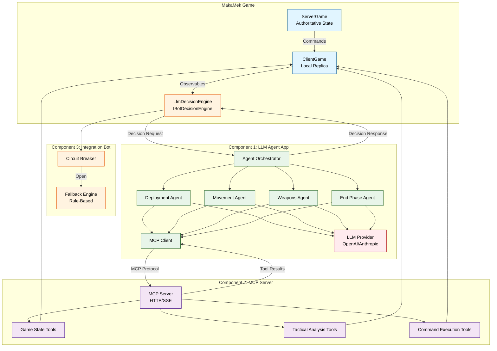

# LLM-Powered Bot System for MakaMek
## Architecture Design & Product Requirements Document

**Version:** 1.1
**Date:** 2026-01-12
**Status:** Design Proposal

---

## Executive Summary

This document presents a comprehensive design for integrating Large Language Model (LLM) powered bots into the MakaMek BattleTech game system. The solution leverages Microsoft Agent Framework for intelligent decision-making and Model Context Protocol (MCP) for seamless game integration, while maintaining compatibility with the existing bot infrastructure.

### Key Benefits

- **Advanced Tactical Reasoning**: LLM agents can analyze complex tactical situations with human-like strategic thinking
- **Adaptive Gameplay**: Agents learn and adapt strategies based on game context
- **Explainable Decisions**: LLM agents can provide reasoning for their tactical choices
- **Scalable Architecture**: Support for multiple concurrent LLM bot players
- **Graceful Degradation**: Fallback to rule-based engines ensures reliability
- **Extensible Design**: Easy to add new capabilities and improve agent performance

### High-Level Architecture

The system consists of three main components:

1. **LLM Agent Application** - Separate .NET 10 application using Microsoft Agent Framework with 4 specialized agents: Deployment, Movement, Weapon Attack, and End-Phase
2. **MCP Server** - Exposes game state and tactical analysis tools via Model Context Protocol
3. **Integration Bot** - Bridge component that monitors game state and coordinates between the game and LLM agents

---

## Table of Contents

1. [Current Architecture Analysis](#current-architecture-analysis)
2. [LLM Bot System Design](#llm-bot-system-design)
3. [Component Specifications](#component-specifications)
4. [MCP API Specification](#mcp-api-specification)
5. [Agent Design](#agent-design)
6. [Integration Patterns](#integration-patterns)
7. [Implementation Roadmap](#implementation-roadmap)
8. [Technical Specifications](#technical-specifications)
9. [Operational Considerations](#operational-considerations)
10. [Appendices](#appendices)

---

## 1. Current Architecture Analysis

### 1.1 Server-Client Architecture

MakaMek uses a distributed architecture with clear separation between authoritative server and client game instances:

#### ServerGame
- **Location**: `src/MakaMek.Core/Models/Game/ServerGame.cs`
- **Responsibilities**:
  - Maintains authoritative game state
  - Validates and processes client commands
  - Manages phase transitions via `IPhaseManager`
  - Broadcasts state changes to all clients
  - Handles dice rolling and random events
  - Enforces game rules

#### ClientGame
- **Location**: `src/MakaMek.Core/Models/Game/ClientGame.cs`
- **Responsibilities**:
  - Maintains local replica of game state
  - Sends player commands to server
  - Receives and applies server updates
  - Provides reactive observables for state changes
  - Manages command acknowledgment and idempotency
  - Supports multiple local players (including bots)

#### Command Flow
```
Client → IClientCommand → CommandPublisher → Transport → Server
Server → Validation → Processing → IGameCommand → Broadcast → All Clients
```

**Key Insight**: One ClientGame instance serves ALL local players (human and bot), as documented in project memories.

### 1.2 Bot System Overview

#### Current Bot Architecture
- **Bot Class**: `src/MakaMek.Bots/Models/Bot.cs`
  - Observes ClientGame via reactive subscriptions
  - Monitors `PhaseChanges`, `PhaseStepChanges`, and `Commands` observables
  - Triggers decision-making when bot becomes active player
  - Delegates decisions to phase-specific engines

#### Decision Engines
- **Interface**: `IBotDecisionEngine` - `src/MakaMek.Bots/Models/DecisionEngines/IBotDecisionEngine.cs`
- **Implementations**:
  - `DeploymentEngine` - Selects deployment hexes and facing
  - `MovementEngine` - Evaluates movement paths using tactical scoring
  - `WeaponsEngine` - Selects targets and weapon configurations
  - `EndPhaseEngine` - Manages heat, shutdown, and startup decisions

#### Tactical Evaluator
- **Location**: `src/MakaMek.Bots/Models/DecisionEngines/TacticalEvaluator.cs`
- **Capabilities**:
  - Evaluates movement paths with offensive/defensive scoring
  - Calculates hit probabilities using `ToHitCalculator`
  - Scores weapon configurations and target priorities
  - Considers terrain, line of sight, and range
  - Caches evaluations for performance

### 1.3 Game Phases

MakaMek implements the following game phases (from `PhaseNames.cs`):

1. **Start** - Lobby and player joining
2. **Deployment** - Unit placement on map
3. **Initiative** - Turn order determination
4. **Movement** - Unit movement and positioning
5. **WeaponsAttack** - Weapon target declaration
6. **WeaponAttackResolution** - Attack resolution and damage
7. **PhysicalAttack** - Melee combat (not yet implemented)
8. **Heat** - Heat management and effects
9. **End** - Turn cleanup and phase cycling

Phase transitions are managed by `BattleTechPhaseManager` which implements the standard BattleTech turn sequence.

### 1.4 Command System

#### Command Types
- **IClientCommand** - Commands from clients to server (require validation)
  - Include `IdempotencyKey` for duplicate detection
  - Examples: `DeployUnitCommand`, `MoveUnitCommand`, `WeaponAttackDeclarationCommand`

- **IGameCommand** - Server broadcast commands (already validated)
  - Examples: `ChangePhaseCommand`, `TurnIncrementedCommand`, `SetBattleMapCommand`

#### Transport Layer
- **CommandPublisher** - Pub/sub pattern for command distribution
- **CommandTransportAdapter** - Serialization and transport abstraction
- **ITransportPublisher** - Network transport interface (supports local and network)

---

## 2. LLM Bot System Design

### 2.1 Architecture Overview

The LLM bot system introduces three new components that integrate with the existing MakaMek architecture:

#### Architecture Diagram



┌─────────────────────────────────────────────────────────────────┐
│                        MakaMek Game                              │
│  ┌──────────────┐         ┌──────────────┐                     │
│  │ ServerGame   │◄────────┤ ClientGame   │                     │
│  │              │         │              │                     │
│  └──────────────┘         └──────┬───────┘                     │
│                                   │                              │
│                                   │ Observables                  │
│                                   │ (PhaseChanges,               │
│                                   │  Commands, etc.)             │
│                                   ▼                              │
│                          ┌────────────────┐                     │
│                          │ Integration    │                     │
│                          │ Bot            │◄────┐               │
│                          │ (Component 3)  │     │               │
│                          └────────┬───────┘     │               │
│                                   │             │               │
└───────────────────────────────────┼─────────────┼───────────────┘
                                    │             │
                                    │ MCP         │ MCP
                                    │ Requests    │ Responses
                                    ▼             │
                          ┌─────────────────────┐ │
                          │ MCP Server          │ │
                          │ (Component 2)       │─┘
                          │                     │
                          │ Tools & Resources:  │
                          │ - Game State Query  │
                          │ - Tactical Analysis │
                          │ - Command Execution │
                          └──────────┬──────────┘
                                     │
                                     │ MCP Protocol
                                     │ (HTTP/SSE)
                                     ▼
                          ┌─────────────────────┐
                          │ LLM Agent App       │
                          │ (Component 1)       │
                          │                     │
                          │ ┌─────────────────┐ │
                          │ │ Orchestrator    │ │
                          │ └────────┬────────┘ │
                          │          │          │
                          │    ┌─────┴─────┐   │
                          │    ▼     ▼     ▼   │
                          │  ┌───┐ ┌───┐ ┌───┐ │
                          │  │Dep│ │Mov│ │Wpn│ │
                          │  │Agt│ │Agt│ │Agt│ │
                          │  └───┘ └───┘ └───┘ │
                          └─────────────────────┘
                                     │
                                     ▼
                          ┌─────────────────────┐
                          │ LLM Provider        │
                          │ (OpenAI/Anthropic)  │
                          └─────────────────────┘
```

### 2.2 Component Responsibilities

#### Component 1: LLM Agent Application
**Type**: Separate .NET 10 Console/Service Application
**Technology**: Microsoft Agent Framework + LLM SDKs

**Responsibilities**:
- Host 4 specialized agents: Deployment, Movement, Weapon Attack, and End-Phase
- Orchestrate agent selection based on game phase
- Communicate with LLM providers (OpenAI, Anthropic, Azure OpenAI)
- Use MCP tools to query game state and execute actions
- Generate tactical decisions with reasoning
- Manage conversation context across turns

**Key Features**:
- Multi-agent architecture with phase-specific specialization
- Chain-of-thought reasoning for complex decisions
- Structured output generation for reliable parsing
- Streaming responses for faster decision-making
- Configurable LLM provider and model selection

#### Component 2: MCP Server
**Type**: .NET 10 Library (combined with Component 3)
**Technology**: Model Context Protocol C# SDK

**Responsibilities**:
- Implement MCP protocol server
- Expose game state query tools
- Expose tactical analysis tools (leveraging TacticalEvaluator)
- Expose command execution tools
- Provide real-time game state resources
- Handle tool call validation and error handling
- Cache tactical evaluations for performance

**Key Features**:
- Comprehensive tool catalog for game interaction
- Resource-based access to game state
- Real-time synchronization via ClientGame observables
- Performance optimization through caching
- Detailed error responses for debugging

#### Component 3: Integration Bot
**Type**: .NET 10 Library implementing IBotDecisionEngine
**Technology**: .NET 10, Reactive Extensions

**Responsibilities**:
- Implement IBotDecisionEngine interface
- Monitor game state changes via ClientGame observables
- Trigger LLM agent requests based on phase and context
- Translate LLM responses to game commands
- Manage communication with LLM Agent Application
- Implement fallback to rule-based engines
- Handle error recovery and circuit breaking
- Provide telemetry and logging

**Key Features**:
- Seamless integration with existing bot infrastructure
- Circuit breaker pattern for resilience
- Automatic fallback to rule-based decisions
- Comprehensive error handling
- Performance monitoring and metrics

### 2.3 Data Flow

#### Decision-Making Flow


**Flow Steps**:

1. **Game State Change**
   - ServerGame broadcasts phase change or active player change
   - ClientGame receives update and publishes to observables

2. **Trigger Detection**
   - Integration Bot detects relevant change via subscription
   - Determines if LLM decision is needed based on phase and player

3. **Context Gathering**
   - Integration Bot calls MCP Server tools to gather context
   - MCP Server queries ClientGame and TacticalEvaluator
   - Returns comprehensive game state and tactical analysis

4. **LLM Decision Request**
   - Integration Bot sends decision request to LLM Agent Application
   - Includes game context, available actions, and constraints

5. **Agent Processing**
   - Agent Orchestrator selects appropriate specialized agent (1 of 4)
   - Agent uses MCP tools to analyze situation
   - Agent generates decision with reasoning using LLM

6. **Command Translation**
   - Integration Bot receives LLM decision
   - Validates decision against game rules
   - Translates to appropriate IClientCommand

7. **Command Execution**
   - Integration Bot sends command via ClientGame
   - ClientGame sends to ServerGame with idempotency key
   - ServerGame validates, processes, and broadcasts

8. **State Update**
   - All clients receive updated game state
   - Cycle continues for next decision point

#### Error Handling Flow

```
LLM Request → Timeout? → Retry (3x) → Still Failing? → Circuit Breaker
                                                              ↓
                                                    Fallback to Rule-Based
                                                              ↓
                                                    Execute Valid Action
```

### 2.4 Technology Stack

#### Component 1: LLM Agent Application
- **Framework**: .NET 10
- **Agent Framework**: Microsoft Agent Framework
- **LLM SDKs**:
  - OpenAI .NET SDK
  - Anthropic .NET SDK
  - Azure.AI.OpenAI
- **MCP Client**: ModelContextProtocol.SDK
- **Configuration**: Microsoft.Extensions.Configuration
- **Logging**: Microsoft.Extensions.Logging

#### Component 2: MCP Server
- **Framework**: .NET 10
- **MCP SDK**: ModelContextProtocol.SDK (C# implementation)
- **Transport**: HTTP/SSE (Server-Sent Events)
- **Serialization**: System.Text.Json
- **Caching**: Microsoft.Extensions.Caching.Memory

#### Component 3: Integration Bot
- **Framework**: .NET 10
- **Dependencies**: MakaMek.Core, MakaMek.Bots
- **Reactive**: System.Reactive
- **HTTP Client**: System.Net.Http
- **Resilience**: Polly (for circuit breaker)
- **Telemetry**: OpenTelemetry


---

## 3. Component Specifications

### 3.1 Component 1: LLM Agent Application

#### 3.1.1 Project Structure

```
MakaMek.LlmAgent/
├── Program.cs                          # Application entry point
├── Configuration/
│   ├── AgentConfiguration.cs           # Agent settings
│   └── LlmProviderConfiguration.cs     # LLM provider settings
├── Orchestration/
│   ├── AgentOrchestrator.cs            # Agent selection and coordination
│   └── ConversationManager.cs          # Multi-turn conversation handling
├── Agents/
│   ├── BaseAgent.cs                    # Base class for all agents
│   ├── DeploymentAgent.cs              # Deployment phase decisions
│   ├── MovementAgent.cs                # Movement phase decisions
│   ├── WeaponsAttackAgent.cs           # Weapons attack phase decisions
│   └── EndPhaseAgent.cs                # End phase decisions
├── Skills/
│   ├── TacticalAnalysisSkill.cs        # Tactical reasoning skill
│   ├── GameStateQuerySkill.cs          # Game state querying skill
│   └── CommandExecutionSkill.cs        # Command execution skill
├── Prompts/
│   ├── SystemPrompts.cs                # System prompts for each agent
│   ├── DeploymentPrompts.cs            # Deployment-specific prompts
│   ├── MovementPrompts.cs              # Movement-specific prompts
│   ├── WeaponsAttackPrompts.cs         # Weapons attack prompts
│   └── EndPhasePrompts.cs              # End phase prompts
├── Services/
│   ├── ILlmProvider.cs                 # LLM provider abstraction
│   ├── OpenAIProvider.cs               # OpenAI implementation
│   ├── AnthropicProvider.cs            # Anthropic implementation
│   └── McpClientService.cs             # MCP client for tool calls
└── Models/
    ├── DecisionRequest.cs              # Request from Integration Bot
    ├── DecisionResponse.cs             # Response to Integration Bot
    └── GameContext.cs                  # Game state context
```

#### 3.1.2 Agent Specifications

##### DeploymentAgent
**Purpose**: Select optimal deployment position and facing for units

**System Prompt**:
```
You are a BattleTech tactical AI specializing in unit deployment. Your goal is to
select deployment positions that maximize tactical advantage while considering:
- Distance to enemy units
- Terrain cover and elevation
- Line of sight to objectives
- Support from friendly units
- Escape routes and maneuverability

Analyze the available deployment zones and select the best position and facing.
```

**Available Tools**:
- `get_deployment_zones` - Get valid deployment hexes
- `get_map_info` - Analyze terrain and elevation
- `get_game_state` - See enemy positions
- `execute_deploy_unit` - Deploy unit to selected hex

**Decision Output**:
```json
{
  "action": "deploy",
  "unitId": "guid",
  "hexCoordinates": {"q": 10, "r": 5},
  "facing": "North",
  "reasoning": "Selected position provides cover while maintaining line of sight..."
}
```

##### MovementAgent
**Purpose**: Evaluate movement options and select optimal path

**System Prompt**:
```
You are a BattleTech tactical AI specializing in mech movement. Your goal is to
position units for maximum tactical advantage while minimizing risk. Consider:
- Offensive positioning (weapon range, line of sight to enemies)
- Defensive positioning (cover, minimizing rear arc exposure)
- Heat management (walking vs running vs jumping)
- Terrain effects (elevation, woods, water)
- Piloting skill roll requirements

Use the tactical evaluation tools to score movement options and select the best path.
```

**Available Tools**:
- `evaluate_movement_options` - Get scored movement paths
- `get_tactical_situation` - Comprehensive tactical analysis
- `calculate_hit_probability` - Estimate attack success
- `execute_move_unit` - Execute selected movement

**Decision Output**:
```json
{
  "action": "move",
  "unitId": "guid",
  "movementPath": [...],
  "movementType": "Walk",
  "reasoning": "Walking to hex (12,8) provides optimal firing position..."
}
```

##### WeaponsAttackAgent
**Purpose**: Select targets and weapon configurations for maximum damage

**System Prompt**:
```
You are a BattleTech tactical AI specializing in weapons targeting. Your goal is to
maximize damage output while managing heat and ammunition. Consider:
- Target priority (damaged units, high-value targets)
- Hit probability vs potential damage
- Heat generation and shutdown risk
- Ammunition conservation
- Weapon configurations (torso twist, aimed shots)

Analyze available targets and select the optimal weapon configuration and target.
```

**Available Tools**:
- `evaluate_weapon_targets` - Get scored target options
- `calculate_hit_probability` - Estimate hit chance
- `get_unit_details` - Analyze target damage state
- `execute_weapon_attack` - Declare attack

**Decision Output**:
```json
{
  "action": "attack",
  "attackerUnitId": "guid",
  "targetUnitId": "guid",
  "weaponIds": ["guid1", "guid2"],
  "configuration": {"type": "TorsoRotation", "value": 1},
  "reasoning": "Targeting damaged enemy mech with high hit probability..."
}
```

##### EndPhaseAgent
**Purpose**: Manage heat, shutdown, and startup decisions

**System Prompt**:
```
You are a BattleTech tactical AI specializing in heat management. Your goal is to
keep units operational while avoiding catastrophic heat effects. Consider:
- Current heat level and dissipation rate
- Ammo explosion risk at high heat
- Shutdown vs continued operation trade-offs
- Restart probability for shutdown units
- Next turn tactical requirements

Make decisions about shutting down overheated units or restarting shutdown units.
```

**Available Tools**:
- `get_unit_details` - Check heat levels
- `calculate_restart_probability` - Estimate restart success
- `execute_shutdown_unit` - Shutdown overheated unit
- `execute_startup_unit` - Attempt restart
- `execute_end_turn` - End turn

**Decision Output**:
```json
{
  "action": "shutdown",
  "unitId": "guid",
  "reasoning": "Heat level 28 with ammo - shutting down to prevent explosion..."
}
```

#### 3.1.3 LLM Provider Configuration

```json
{
  "LlmProvider": {
    "Type": "OpenAI",  // OpenAI, Anthropic, AzureOpenAI
    "ApiKey": "sk-...",
    "Model": "gpt-4o",
    "Temperature": 0.7,
    "MaxTokens": 2000,
    "EnableStreaming": true,
    "EnableChainOfThought": true,
    "Timeout": 30000
  }
}
```

**Supported Models**:
- **OpenAI**: gpt-4o, gpt-4-turbo, gpt-4, gpt-3.5-turbo
- **Anthropic**: claude-3-5-sonnet-20241022, claude-3-opus-20240229
- **Azure OpenAI**: Any deployed model

### 3.2 Component 2: MCP Server

#### 3.2.1 Project Structure

```
MakaMek.Bots.Llm/Mcp/
├── McpServer.cs                        # MCP server implementation
├── Tools/
│   ├── GameStateTools.cs               # Game state query tools
│   ├── TacticalAnalysisTools.cs        # Tactical evaluation tools
│   ├── CommandExecutionTools.cs        # Command execution tools
│   └── ToolRegistry.cs                 # Tool registration
├── Resources/
│   ├── GameStateResource.cs            # Current game state
│   ├── UnitResource.cs                 # Unit details
│   └── MapResource.cs                  # Map information
└── Models/
    ├── ToolDefinition.cs               # Tool metadata
    ├── ToolRequest.cs                  # Tool invocation request
    └── ToolResponse.cs                 # Tool invocation response
```

#### 3.2.2 Tool Catalog

##### Game State Query Tools

**1. get_game_state**
```json
{
  "name": "get_game_state",
  "description": "Returns current game state including phase, turn, players, and units",
  "inputSchema": {
    "type": "object",
    "properties": {},
    "required": []
  }
}
```

**Response**:
```json
{
  "gameId": "guid",
  "turn": 3,
  "phase": "Movement",
  "activePlayer": {
    "id": "guid",
    "name": "Player 1",
    "unitsToPlay": 2
  },
  "players": [...],
  "units": [...]
}
```

**2. get_unit_details**
```json
{
  "name": "get_unit_details",
  "description": "Returns detailed information about a specific unit",
  "inputSchema": {
    "type": "object",
    "properties": {
      "unitId": {"type": "string", "description": "GUID of the unit"}
    },
    "required": ["unitId"]
  }
}
```

**Response**:
```json
{
  "unitId": "guid",
  "name": "Atlas AS7-D",
  "position": {"q": 10, "r": 5, "facing": "North"},
  "armor": {...},
  "structure": {...},
  "weapons": [...],
  "heat": {"current": 12, "capacity": 30},
  "movement": {"walking": 3, "running": 5, "jumping": 0},
  "status": {"isProne": false, "isShutdown": false}
}
```

**3. get_map_info**
```json
{
  "name": "get_map_info",
  "description": "Returns battle map information including terrain and line of sight",
  "inputSchema": {
    "type": "object",
    "properties": {
      "fromHex": {"type": "object", "description": "Source hex coordinates"},
      "toHex": {"type": "object", "description": "Target hex coordinates"}
    }
  }
}
```

**4. get_deployment_zones**
```json
{
  "name": "get_deployment_zones",
  "description": "Returns valid deployment hexes for the current player",
  "inputSchema": {
    "type": "object",
    "properties": {
      "playerId": {"type": "string"}
    },
    "required": ["playerId"]
  }
}
```

##### Tactical Analysis Tools

**5. evaluate_movement_options**
```json
{
  "name": "evaluate_movement_options",
  "description": "Evaluates all possible movement options for a unit and returns scored paths",
  "inputSchema": {
    "type": "object",
    "properties": {
      "unitId": {"type": "string", "description": "GUID of the unit"},
      "maxPaths": {"type": "integer", "description": "Maximum paths to return", "default": 10}
    },
    "required": ["unitId"]
  }
}
```

**Response**:
```json
{
  "paths": [
    {
      "destination": {"q": 12, "r": 8, "facing": "North"},
      "movementType": "Walk",
      "offensiveScore": 45.2,
      "defensiveScore": 12.3,
      "enemiesInRearArc": 0,
      "hexesTraveled": 3
    }
  ]
}
```

**6. evaluate_weapon_targets**
```json
{
  "name": "evaluate_weapon_targets",
  "description": "Evaluates potential weapon targets and returns scored options",
  "inputSchema": {
    "type": "object",
    "properties": {
      "attackerUnitId": {"type": "string"},
      "maxTargets": {"type": "integer", "default": 5}
    },
    "required": ["attackerUnitId"]
  }
}
```

**Response**:
```json
{
  "targets": [
    {
      "targetId": "guid",
      "configurations": [
        {
          "type": "TorsoRotation",
          "value": 1,
          "score": 38.5,
          "weapons": [
            {
              "weaponId": "guid",
              "name": "PPC",
              "hitProbability": 0.72,
              "damage": 10
            }
          ]
        }
      ]
    }
  ]
}
```

**7. calculate_hit_probability**
```json
{
  "name": "calculate_hit_probability",
  "description": "Calculates hit probability for a weapon attack",
  "inputSchema": {
    "type": "object",
    "properties": {
      "attackerUnitId": {"type": "string"},
      "targetUnitId": {"type": "string"},
      "weaponId": {"type": "string"}
    },
    "required": ["attackerUnitId", "targetUnitId", "weaponId"]
  }
}
```

**8. get_tactical_situation**
```json
{
  "name": "get_tactical_situation",
  "description": "Returns comprehensive tactical analysis for the current player",
  "inputSchema": {
    "type": "object",
    "properties": {
      "playerId": {"type": "string"}
    },
    "required": ["playerId"]
  }
}
```

##### Command Execution Tools

**9. execute_deploy_unit**
```json
{
  "name": "execute_deploy_unit",
  "description": "Deploys a unit to the specified hex and facing",
  "inputSchema": {
    "type": "object",
    "properties": {
      "unitId": {"type": "string"},
      "hexCoordinates": {"type": "object"},
      "facing": {"type": "string"}
    },
    "required": ["unitId", "hexCoordinates", "facing"]
  }
}
```

**10. execute_move_unit**
```json
{
  "name": "execute_move_unit",
  "description": "Moves a unit along the specified path",
  "inputSchema": {
    "type": "object",
    "properties": {
      "unitId": {"type": "string"},
      "movementPath": {"type": "array"},
      "movementType": {"type": "string"}
    },
    "required": ["unitId", "movementPath", "movementType"]
  }
}
```

**11. execute_weapon_attack**
```json
{
  "name": "execute_weapon_attack",
  "description": "Declares a weapon attack on the specified target",
  "inputSchema": {
    "type": "object",
    "properties": {
      "attackerUnitId": {"type": "string"},
      "targetUnitId": {"type": "string"},
      "weaponIds": {"type": "array"},
      "configuration": {"type": "object"}
    },
    "required": ["attackerUnitId", "targetUnitId", "weaponIds"]
  }
}
```

**12. execute_end_turn**
```json
{
  "name": "execute_end_turn",
  "description": "Ends the current player's turn",
  "inputSchema": {
    "type": "object",
    "properties": {
      "playerId": {"type": "string"}
    },
    "required": ["playerId"]
  }
}
```

**13. execute_shutdown_unit**
```json
{
  "name": "execute_shutdown_unit",
  "description": "Shuts down an overheated unit",
  "inputSchema": {
    "type": "object",
    "properties": {
      "unitId": {"type": "string"}
    },
    "required": ["unitId"]
  }
}
```

**14. execute_startup_unit**
```json
{
  "name": "execute_startup_unit",
  "description": "Attempts to restart a shutdown unit",
  "inputSchema": {
    "type": "object",
    "properties": {
      "unitId": {"type": "string"}
    },
    "required": ["unitId"]
  }
}
```

#### 3.2.3 MCP Resources

**Resource URIs**:
- `game://state` - Current game state snapshot
- `game://units/{unitId}` - Specific unit details
- `game://map` - Battle map data
- `game://tactical-analysis/{playerId}` - Cached tactical evaluations

### 3.3 Component 3: Integration Bot

#### 3.3.1 Project Structure

```
MakaMek.Bots.Llm/
├── Models/
│   ├── LlmDecisionEngine.cs            # Implements IBotDecisionEngine
│   ├── LlmBot.cs                       # Extends Bot class
│   └── LlmBotManager.cs                # Manages LLM bot lifecycle
├── Services/
│   ├── ILlmAgentClient.cs              # LLM Agent communication interface
│   ├── LlmAgentClient.cs               # HTTP client for LLM Agent
│   ├── CircuitBreaker.cs               # Circuit breaker implementation
│   └── FallbackDecisionEngine.cs       # Fallback to rule-based
├── Configuration/
│   └── LlmBotConfiguration.cs          # Configuration model
└── Telemetry/
    ├── LlmBotMetrics.cs                # Performance metrics
    └── DecisionLogger.cs               # Decision logging
```

#### 3.3.2 LlmDecisionEngine Implementation

```csharp
public class LlmDecisionEngine : IBotDecisionEngine
{
    private readonly ILlmAgentClient _llmAgentClient;
    private readonly IClientGame _clientGame;
    private readonly CircuitBreaker _circuitBreaker;
    private readonly FallbackDecisionEngine _fallbackEngine;
    private readonly ILogger<LlmDecisionEngine> _logger;

    public async Task MakeDecision(IPlayer player, ITurnState? turnState = null)
    {
        try
        {
            // Check circuit breaker state
            if (_circuitBreaker.IsOpen)
            {
                _logger.LogWarning("Circuit breaker open, using fallback");
                await _fallbackEngine.MakeDecision(player, turnState);
                return;
            }

            // Gather game context
            var context = await GatherGameContext(player, turnState);

            // Request decision from LLM Agent
            var decision = await _llmAgentClient.RequestDecision(context);

            // Validate and execute decision
            await ExecuteDecision(player, decision);

            _circuitBreaker.RecordSuccess();
        }
        catch (Exception ex)
        {
            _logger.LogError(ex, "LLM decision failed");
            _circuitBreaker.RecordFailure();

            // Fallback to rule-based engine
            await _fallbackEngine.MakeDecision(player, turnState);
        }
    }
}
```

#### 3.3.3 Circuit Breaker Configuration

```json
{
  "CircuitBreaker": {
    "FailureThreshold": 3,
    "SuccessThreshold": 2,
    "Timeout": 30000,
    "HalfOpenRetryDelay": 60000
  }
}
```

**States**:
- **Closed**: Normal operation, requests pass through
- **Open**: Too many failures, all requests use fallback
- **Half-Open**: Testing if service recovered, limited requests

---

## 4. Integration Patterns

### 4.1 Game State Synchronization

The Integration Bot maintains real-time synchronization with the game through reactive subscriptions:

```csharp
// Subscribe to phase changes
_clientGame.PhaseChanges.Subscribe(phase => {
    _currentPhase = phase;
    UpdateAgentContext();
});

// Subscribe to active player changes
_clientGame.PhaseStepChanges.Subscribe(phaseStep => {
    if (phaseStep?.ActivePlayer.Id == _playerId)
    {
        TriggerDecisionMaking();
    }
});

// Subscribe to command updates
_clientGame.Commands.Subscribe(command => {
    UpdateGameStateCache(command);
});
```

### 4.2 Command Translation

LLM decisions are translated to game commands with validation:

```csharp
private async Task<IClientCommand> TranslateDecision(DecisionResponse decision)
{
    return decision.Action switch
    {
        "deploy" => new DeployUnitCommand
        {
            PlayerId = decision.PlayerId,
            UnitId = decision.UnitId,
            Position = decision.HexCoordinates.ToData(),
            Direction = ParseDirection(decision.Facing)
        },
        "move" => new MoveUnitCommand
        {
            PlayerId = decision.PlayerId,
            UnitId = decision.UnitId,
            MovementPath = decision.MovementPath.ToData(),
            MovementType = ParseMovementType(decision.MovementType)
        },
        "attack" => new WeaponAttackDeclarationCommand
        {
            PlayerId = decision.PlayerId,
            AttackerUnitId = decision.AttackerUnitId,
            TargetUnitId = decision.TargetUnitId,
            WeaponIds = decision.WeaponIds,
            Configuration = decision.Configuration
        },
        _ => throw new InvalidOperationException($"Unknown action: {decision.Action}")
    };
}
```

### 4.3 Error Handling Strategy

**Retry Logic**:
```csharp
var retryPolicy = Policy
    .Handle<HttpRequestException>()
    .Or<TaskCanceledException>()
    .WaitAndRetryAsync(3,
        retryAttempt => TimeSpan.FromSeconds(Math.Pow(2, retryAttempt)),
        onRetry: (exception, timeSpan, retryCount, context) =>
        {
            _logger.LogWarning($"Retry {retryCount} after {timeSpan}");
        });
```

**Fallback Strategy**:
1. Primary: LLM-based decision via Agent Application
2. Secondary: Rule-based decision via existing engines
3. Tertiary: Random valid action (last resort)

### 4.4 Performance Optimization

**Caching Strategy**:
- Tactical evaluations cached per turn
- Game state snapshots cached per phase
- Hit probability calculations cached
- Cache invalidated on relevant state changes

**Parallel Processing**:
- Multiple tool calls executed in parallel
- Tactical evaluations for multiple units in parallel
- Non-blocking async/await throughout

---

## 5. Implementation Roadmap

### Phase 1: Foundation (Weeks 1-2)

**Objectives**:
- Set up project structure for all three components
- Implement basic MCP server with core tools
- Create Integration Bot skeleton
- Set up LLM Agent Application with orchestrator

**Deliverables**:
- `MakaMek.Bots.Llm` project created
- `MakaMek.LlmAgent` project created
- Basic MCP server with `get_game_state` and `get_unit_details` tools
- Integration Bot implementing `IBotDecisionEngine`
- Agent Orchestrator with phase-based routing

**Dependencies**:
- ModelContextProtocol.SDK NuGet package
- Microsoft.AgentFramework NuGet package
- OpenAI/Anthropic SDK packages

### Phase 2: MCP Server Implementation (Weeks 3-4)

**Objectives**:
- Implement all game state query tools
- Implement tactical analysis tools
- Implement command execution tools
- Add real-time synchronization
- Implement caching layer

**Deliverables**:
- Complete tool catalog (14 tools)
- MCP resources for game state
- Integration with TacticalEvaluator
- Performance-optimized caching
- Comprehensive error handling

**Testing**:
- Unit tests for each tool
- Integration tests with ClientGame
- Performance benchmarks

### Phase 3: LLM Agent Development (Weeks 5-6)

**Objectives**:
- Implement all specialized agents
- Create system prompts for each phase
- Implement LLM provider abstraction
- Add structured output parsing
- Implement MCP client for tool calls

**Deliverables**:
- 4 specialized agents: DeploymentAgent, MovementAgent, WeaponsAttackAgent, EndPhaseAgent
- System prompts with BattleTech tactical knowledge for each agent
- OpenAI and Anthropic provider implementations
- Robust JSON parsing with validation
- MCP client service

**Testing**:
- Agent decision quality tests
- Prompt effectiveness evaluation
- LLM provider integration tests

### Phase 4: Integration Bot (Weeks 7-8)

**Objectives**:
- Implement complete decision-making flow
- Add circuit breaker pattern
- Implement fallback logic
- Add telemetry and logging
- Integrate with existing bot infrastructure

**Deliverables**:
- Complete LlmDecisionEngine implementation
- Circuit breaker with configurable thresholds
- Fallback to rule-based engines
- OpenTelemetry integration
- Comprehensive logging

**Testing**:
- End-to-end integration tests
- Failure scenario tests
- Circuit breaker behavior tests
- Performance tests

### Phase 5: Testing & Refinement (Weeks 9-10)

**Objectives**:
- Comprehensive testing of all components
- Performance optimization
- Prompt engineering and tuning
- Multi-bot concurrency testing
- Documentation

**Deliverables**:
- Full test suite with >80% coverage
- Performance benchmarks and optimizations
- Tuned prompts for better decisions
- Multi-bot stress tests
- User documentation and examples

**Testing**:
- Load testing with multiple concurrent bots
- Long-running game tests
- Decision quality evaluation
- Cost analysis for LLM API usage

### Phase 6: Advanced Features (Weeks 11-12)

**Objectives**:
- Multi-turn conversation support
- Learning from game outcomes
- Difficulty levels via prompt tuning
- Advanced tactical reasoning
- Decision explanation generation

**Deliverables**:
- Conversation history management
- Game outcome analysis
- Configurable difficulty settings
- Enhanced tactical prompts
- Decision explanation UI

**Testing**:
- User acceptance testing
- Difficulty level validation
- Explanation quality evaluation

---

## 6. Technical Specifications

### 6.1 Project Structure

```
MakaMek.sln
├── src/
│   ├── MakaMek.Core/                    (existing)
│   ├── MakaMek.Bots/                    (existing)
│   ├── MakaMek.Bots.Llm/                (new)
│   │   ├── MakaMek.Bots.Llm.csproj
│   │   ├── Models/
│   │   ├── Services/
│   │   ├── Mcp/
│   │   ├── Configuration/
│   │   └── Telemetry/
│   └── MakaMek.LlmAgent/                (new)
│       ├── MakaMek.LlmAgent.csproj
│       ├── Program.cs
│       ├── Agents/
│       ├── Skills/
│       ├── Prompts/
│       ├── Services/
│       └── Configuration/
└── tests/
    ├── MakaMek.Bots.Llm.Tests/          (new)
    └── MakaMek.LlmAgent.Tests/          (new)
```

### 6.2 Dependencies

#### MakaMek.Bots.Llm
```xml
<ItemGroup>
  <ProjectReference Include="..\MakaMek.Core\MakaMek.Core.csproj" />
  <ProjectReference Include="..\MakaMek.Bots\MakaMek.Bots.csproj" />
  <PackageReference Include="ModelContextProtocol.SDK" Version="1.0.0" />
  <PackageReference Include="Polly" Version="8.0.0" />
  <PackageReference Include="OpenTelemetry" Version="1.7.0" />
  <PackageReference Include="System.Reactive" Version="6.0.0" />
</ItemGroup>
```

#### MakaMek.LlmAgent
```xml
<ItemGroup>
  <PackageReference Include="Microsoft.AgentFramework" Version="1.0.0" />
  <PackageReference Include="ModelContextProtocol.SDK" Version="1.0.0" />
  <PackageReference Include="OpenAI" Version="2.0.0" />
  <PackageReference Include="Anthropic.SDK" Version="1.0.0" />
  <PackageReference Include="Azure.AI.OpenAI" Version="2.0.0" />
  <PackageReference Include="Microsoft.Extensions.Configuration" Version="10.0.0" />
  <PackageReference Include="Microsoft.Extensions.Logging" Version="10.0.0" />
</ItemGroup>
```

### 6.3 Configuration Files

#### appsettings.json (MakaMek.LlmAgent)
```json
{
  "LlmProvider": {
    "Type": "OpenAI",
    "ApiKey": "${OPENAI_API_KEY}",
    "Model": "gpt-4o",
    "Temperature": 0.7,
    "MaxTokens": 2000,
    "EnableStreaming": true,
    "Timeout": 30000
  },
  "McpServer": {
    "Port": 5000,
    "EnableSse": true
  },
  "Logging": {
    "LogLevel": {
      "Default": "Information",
      "Microsoft": "Warning"
    }
  }
}
```

#### appsettings.json (Integration Bot)
```json
{
  "LlmBot": {
    "AgentEndpoint": "http://localhost:5000",
    "EnableFallback": true,
    "DecisionTimeout": 30000,
    "CircuitBreaker": {
      "FailureThreshold": 3,
      "SuccessThreshold": 2,
      "Timeout": 30000,
      "HalfOpenRetryDelay": 60000
    }
  },
  "Telemetry": {
    "EnableMetrics": true,
    "EnableLogging": true
  }
}
```

---

## 7. Operational Considerations

### 7.1 Cost Management

**LLM API Costs**:
- **GPT-4o**: ~$0.005 per decision (estimated 1000 tokens)
- **Claude 3.5 Sonnet**: ~$0.003 per decision
- **GPT-3.5-turbo**: ~$0.001 per decision (lower quality)

**Cost Optimization Strategies**:
1. Use cheaper models for simpler decisions (deployment, end phase)
2. Cache tactical evaluations to reduce tool calls
3. Implement token budgets per decision
4. Use streaming to reduce latency without increasing cost
5. Batch multiple decisions when possible

**Estimated Monthly Costs** (1000 games, 50 turns avg, 4 decisions per turn):
- GPT-4o: ~$1,000/month
- Claude 3.5 Sonnet: ~$600/month
- GPT-3.5-turbo: ~$200/month

### 7.2 Performance Metrics

**Target Metrics**:
- **Decision Latency**: <5 seconds per decision (P95)
- **Throughput**: 10+ concurrent bot players
- **Availability**: 99.5% uptime
- **Fallback Rate**: <5% of decisions
- **Cache Hit Rate**: >70% for tactical evaluations

**Monitoring**:
- OpenTelemetry metrics for latency, throughput, errors
- Custom metrics for decision quality
- LLM API usage and cost tracking
- Circuit breaker state monitoring

### 7.3 Security Considerations

**API Key Management**:
- Store API keys in environment variables or Azure Key Vault
- Never commit API keys to source control
- Rotate keys regularly
- Use separate keys for dev/test/prod

**Input Validation**:
- Validate all LLM outputs before execution
- Sanitize game state data before sending to LLM
- Implement rate limiting to prevent abuse
- Log all decisions for audit trail

**Network Security**:
- Use HTTPS for all MCP communication
- Implement authentication for MCP server
- Restrict MCP server to localhost or trusted networks
- Use API gateways for production deployments

### 7.4 Scalability

**Horizontal Scaling**:
- Multiple LLM Agent Application instances behind load balancer
- Stateless design enables easy scaling
- MCP server can be replicated per game instance
- Integration Bot scales with number of bot players

**Vertical Scaling**:
- Increase LLM token limits for complex decisions
- Use more powerful models for higher difficulty
- Optimize caching to reduce memory usage
- Tune thread pool sizes for better concurrency

### 7.5 Deployment

**Development Environment**:
```bash
# Start MCP Server (embedded in Integration Bot)
dotnet run --project src/MakaMek.Bots.Llm

# Start LLM Agent Application
dotnet run --project src/MakaMek.LlmAgent

# Run game with LLM bot
dotnet run --project src/MakaMek.Presentation --bot-type llm
```

**Production Environment**:
- Deploy LLM Agent Application as containerized service
- Use Kubernetes for orchestration and scaling
- Configure health checks and readiness probes
- Set up monitoring and alerting
- Implement blue-green deployment for updates

---

## 8. Appendices

### Appendix A: MCP Protocol Overview

**Model Context Protocol (MCP)** is an open protocol that standardizes how applications provide context to LLMs. It enables:

- **Tools**: Functions that LLMs can call to perform actions
- **Resources**: Data sources that LLMs can read
- **Prompts**: Reusable prompt templates
- **Sampling**: LLM completion requests

**Key Benefits**:
- Standardized interface for LLM-application integration
- Language-agnostic protocol (JSON-RPC over HTTP/SSE)
- Built-in support for streaming and real-time updates
- Growing ecosystem of MCP servers and clients

**References**:
- MCP Specification: https://modelcontextprotocol.io/
- C# SDK: https://github.com/modelcontextprotocol/csharp-sdk

### Appendix B: Microsoft Agent Framework

**Microsoft Agent Framework** provides building blocks for creating AI agents:

- **Agent Orchestration**: Coordinate multiple specialized agents
- **Skills**: Reusable capabilities that agents can use
- **Memory**: Conversation history and context management
- **Planning**: Multi-step reasoning and task decomposition
- **Tool Use**: Integration with external tools and APIs

**Key Features**:
- Built on top of Semantic Kernel
- Support for multiple LLM providers
- Structured output generation
- Chain-of-thought reasoning
- Function calling and tool use

**References**:
- Documentation: https://learn.microsoft.com/en-us/semantic-kernel/
- GitHub: https://github.com/microsoft/semantic-kernel

### Appendix C: Alternative Architectures Considered

#### Alternative 1: Direct LLM Integration
**Description**: Integrate LLM calls directly into existing bot engines without MCP.

**Pros**:
- Simpler architecture
- Fewer components to maintain
- Lower latency

**Cons**:
- Tight coupling between game logic and LLM
- Harder to swap LLM providers
- No standardized tool interface
- Difficult to test and debug

**Decision**: Rejected due to tight coupling and lack of flexibility.

#### Alternative 2: Single Monolithic Agent
**Description**: Use one general-purpose agent for all game phases instead of specialized agents.

**Pros**:
- Simpler agent management
- Single system prompt
- Easier to maintain

**Cons**:
- Lower decision quality due to lack of specialization
- Larger context windows required
- Harder to optimize prompts per phase
- More expensive LLM calls

**Decision**: Rejected in favor of specialized agents for better decision quality.

#### Alternative 3: Rule-Based Hybrid
**Description**: Use LLM only for high-level strategy, rule-based for tactical execution.

**Pros**:
- Lower LLM API costs
- Faster tactical decisions
- More predictable behavior

**Cons**:
- Complex integration between LLM and rules
- Limited LLM benefit for tactical decisions
- Harder to tune difficulty levels
- Less explainable decisions

**Decision**: Rejected in favor of full LLM decision-making with rule-based fallback.

### Appendix D: BattleTech Tactical Knowledge

**Key Tactical Concepts for LLM Prompts**:

1. **Range Brackets**: Weapons have optimal ranges (short/medium/long)
2. **Heat Management**: Balance damage output with heat dissipation
3. **Armor Facing**: Protect damaged armor by rotating torso
4. **Terrain Usage**: Use woods/water for cover, elevation for advantage
5. **Target Priority**: Focus fire on damaged units
6. **Movement Types**: Walking (low heat) vs Running (high heat) vs Jumping (highest heat)
7. **Piloting Skill Rolls**: Avoid situations requiring PSRs
8. **Ammunition Conservation**: Don't waste limited ammo on low-probability shots
9. **Shutdown Risk**: Avoid overheating that causes shutdown
10. **Rear Arc Vulnerability**: Minimize exposure of rear armor

**Example Tactical Scenario**:
```
Situation: Atlas (heavy mech) at heat 18/30, facing damaged Jenner (light mech)
Options:
1. Walk forward, fire all weapons (heat +12, high hit probability)
2. Run forward, fire half weapons (heat +8, medium hit probability)
3. Stay put, fire all weapons (heat +10, medium hit probability)

Best Choice: Option 1 - Walking provides stable platform for high hit probability,
heat is manageable, and Jenner is priority target due to existing damage.
```

### Appendix E: Testing Strategy

#### Unit Tests
- **MCP Tools**: Test each tool in isolation with mock ClientGame
- **Agents**: Test prompt generation and decision parsing
- **Integration Bot**: Test command translation and error handling
- **Circuit Breaker**: Test state transitions and fallback logic

#### Integration Tests
- **End-to-End**: Full decision flow from game state to command execution
- **MCP Protocol**: Test tool calls and resource access
- **LLM Provider**: Test with real LLM APIs (using test accounts)
- **Fallback**: Test graceful degradation when LLM unavailable

#### Performance Tests
- **Latency**: Measure decision time under various loads
- **Throughput**: Test concurrent bot players
- **Memory**: Monitor memory usage over long games
- **Cost**: Track LLM API usage and costs

#### Quality Tests
- **Decision Quality**: Compare LLM decisions to expert human decisions
- **Win Rate**: Measure bot performance against rule-based bots
- **Tactical Soundness**: Evaluate decisions against BattleTech tactics
- **Explanation Quality**: Assess reasoning clarity and accuracy

### Appendix F: Future Enhancements

**Short-term (3-6 months)**:
- Support for physical attack phase
- Advanced weapon configurations (aimed shots, called shots)
- Multi-unit coordination strategies
- Difficulty levels (novice, veteran, elite)
- Decision explanation UI

**Medium-term (6-12 months)**:
- Learning from game outcomes (reinforcement learning)
- Personality profiles (aggressive, defensive, balanced)
- Voice commentary on decisions
- Replay analysis and critique
- Tournament mode with ELO ratings

**Long-term (12+ months)**:
- Multi-agent team coordination
- Strategic planning across multiple turns
- Adaptive difficulty based on player skill
- Custom training on specific scenarios
- Integration with MegaMek game data

---

## Conclusion

This design provides a comprehensive, production-ready architecture for integrating LLM-powered bots into MakaMek. The three-component approach (LLM Agent Application, MCP Server, Integration Bot) offers:

- **Flexibility**: Easy to swap LLM providers and models
- **Reliability**: Graceful degradation with fallback to rule-based engines
- **Scalability**: Support for multiple concurrent bot players
- **Maintainability**: Clear separation of concerns and standardized interfaces
- **Extensibility**: Easy to add new capabilities and improve decision quality

The phased implementation roadmap ensures incremental delivery of value while managing risk. The use of industry-standard technologies (Microsoft Agent Framework, Model Context Protocol) ensures long-term viability and community support.

**Next Steps**:
1. Review and approve this design document
2. Set up development environment and project structure
3. Begin Phase 1 implementation (Foundation)
4. Establish testing and quality metrics
5. Iterate based on feedback and performance data

---

**Document Version History**:
- v1.1 (2026-01-12): Updated to .NET 10, clarified 4 specialized agents, embedded Mermaid diagrams
- v1.0 (2026-01-12): Initial comprehensive design document

**Contributors**:
- Architecture Design: AI Assistant
- Technical Review: Pending
- Approval: Pending

