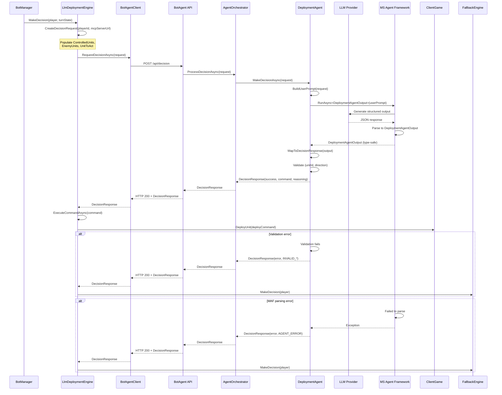

# LLM Deployment Agent - Detailed Design Document

**Version:** 1.1
**Date:** 2026-01-19
**Status:** Design Specification
**Related:** `docs/architecture/llm-bot-system-design.md`

---

## Executive Summary

This document provides a comprehensive design for implementing complete LLM decision-making functionality for the Deployment phase in the MakaMek bot system. The design addresses identified gaps in the current `DeploymentAgent` implementation and provides detailed specifications for:

- Enhanced game state communication via `DecisionRequest`
- MCP tools for deployment zone queries
- **Structured output using Microsoft Agent Framework**
- Enhanced system prompts with BattleTech tactical knowledge
- Complete integration flow with error handling

**Goal**: Enable the `DeploymentAgent` to make informed, tactical deployment decisions using LLM reasoning while maintaining seamless integration with the existing `LlmDeploymentEngine` and fallback mechanisms.

**Key Change in v1.1**: Adoption of Microsoft Agent Framework's structured output feature (`RunAsync<T>`) to eliminate custom JSON parsing and improve reliability.

---

## 1. Current State Analysis

### 1.1 Human Player Deployment (DeploymentState.cs)

**Three-step workflow**:
1. **SelectingUnit**: Player selects which unit to deploy
2. **SelectingHex**: Player selects deployment position (edge hex, unoccupied)
3. **SelectingDirection**: Player selects facing direction (0-5, representing Top, TopRight, BottomRight, Bottom, BottomLeft, TopLeft)

**Command Structure**:
```csharp
DeployUnitCommand {
    UnitId: Guid,
    Position: HexCoordinateData { Q: int, R: int },
    Direction: int (0-5),
    GameOriginId: Guid,
    PlayerId: Guid,
    IdempotencyKey: Guid?
}
```

**Validation**:
- Hex must not be occupied by another unit
- Position must be in deployment zone
- Direction must be 0-5

### 1.2 Rule-Based Bot Deployment (DeploymentEngine.cs)

**Decision Logic**:
1. Find first undeployed unit from player's units
2. Get occupied hexes (all deployed units across all players)
3. Get deployment area using `BattleMap.GetEdgeHexCoordinates()`
4. Filter valid hexes: `deploymentArea - occupiedHexes`
5. Randomly select a valid hex
6. Calculate strategic facing:
   - If enemies deployed: face toward nearest enemy
   - If no enemies: face toward map center
   - Use `HexCoordinates.LineTo()` to get direction
7. Create and send `DeployUnitCommand`

**Key Methods**:
- `GetDeploymentArea()`: Returns edge hexes as `HashSet<HexCoordinates>`
- `GetValidDeploymentHexes()`: Filters unoccupied hexes
- `GetDeploymentDirection()`: Calculates facing based on target

### 1.3 Current LLM System Architecture

**Two-Container Architecture**:
- **Component 1 (BotAgent)**: ASP.NET Core Web API hosting specialized agents
- **Component 2 (BotContainer)**: Integration Bot with MCP Server and ClientGame

**Current DecisionRequest**:
```csharp
public record DecisionRequest(
    Guid PlayerId,
    string Phase,
    string McpServerUrl,
    int Timeout = 30000
);
```

**Current DecisionResponse**:
```csharp
public record DecisionResponse(
    bool Success,
    IGameCommand? Command,
    string? Reasoning,
    string? ErrorType,
    string? ErrorMessage,
    bool FallbackRequired
);
```

**Current DeploymentAgent Issues**:
- `ParseDecision()` returns dummy command with `Guid.Empty` values
- No actual JSON parsing implementation
- No MCP tool integration
- Generic system prompt without tactical guidance
- No game state information in request

---

## 2. Identified Gaps and Requirements

### 2.1 Critical Gaps

1. **Insufficient Game State in DecisionRequest**
   - No unit information (controlled units, enemy units)
   - No deployment zone information
   - No map context
   - Agent cannot make informed decisions without this data

2. **Missing MCP Tools**
   - `McpClientService` has placeholder methods
   - No actual MCP protocol implementation
   - No tools registered with `ChatClientAgent`

3. **No Structured Output Implementation**
   - `ParseDecision()` is a stub
   - Not using MAF's structured output capabilities
   - No validation of LLM output

4. **Generic System Prompt**
   - Lacks BattleTech tactical knowledge
   - No output format specification
   - No guidance on decision criteria

5. **No Validation Layer**
   - No checks for valid unit IDs
   - No position validation
   - No direction range validation

### 2.2 Requirements for Informed Decisions

The agent needs access to:
- **Controlled Units**: List of bot's units with deployment status
- **Enemy Units**: List of enemy units with positions (if deployed)
- **Valid Deployment Zones**: Edge hexes that are unoccupied
- **Unit Selection**: Which unit to deploy (or let agent choose)

---

## 3. Design Decisions

### 3.1 MCP Tools Design

**Approach**: Implement a core MCP tool for deployment decisions

**Tool: get_deployment_zones**
```json
{
  "name": "get_deployment_zones",
  "description": "Get valid deployment hexes (unoccupied edge hexes)",
  "inputSchema": {
    "type": "object",
    "properties": {},
    "required": []
  }
}
```

**Response**:
```json
{
  "validHexes": [
    {"q": 1, "r": 1},
    {"q": 1, "r": 2},
    ...
  ],
  "mapWidth": 10,
  "mapHeight": 10,
  "mapCenter": {"q": 5, "r": 5}
}
```

**Implementation**:
- Call `BattleMap.GetEdgeHexCoordinates()`
- Return list of valid positions with map metadata

**Tool Registration**:
Tools should be registered with `ChatClientAgent` in `DeploymentAgent` constructor:
```csharp
Agent = new ChatClientAgent(
    chatClient: llmProvider.GetChatClient(),
    instructions: SystemPrompt,
    tools: new[] {
        GetDeploymentZonesTool() // next phase, no tools in initial implementation
    }
);
```

### 3.2 Structured Output Strategy

**Approach**: Use Microsoft Agent Framework's `RunAsync<T>` for type-safe structured output

**Key Advantages**:
- ✅ Eliminates custom JSON parsing code
- ✅ Type-safe at compile time
- ✅ Built-in validation by MAF
- ✅ Handles JSON extraction automatically
- ✅ More reliable than regex-based parsing

**Output Record Definition**:
```csharp
/// <summary>
/// Structured output from DeploymentAgent LLM decision.
/// This record is used with ChatClientAgent.RunAsync<T> for type-safe structured output.
/// </summary>
public record DeploymentAgentOutput
{
    /// <summary>
    /// GUID of the unit to deploy (as string for LLM output).
    /// </summary>
    public required string UnitId { get; init; }

    /// <summary>
    /// Hex position for deployment.
    /// </summary>
    public required HexCoordinateData Position { get; init; }

    /// <summary>
    /// Facing direction (0-5).
    /// 0 = Top, 1 = TopRight, 2 = BottomRight, 3 = Bottom, 4 = BottomLeft, 5 = TopLeft
    /// </summary>
    public required int Direction { get; init; }

    /// <summary>
    /// Tactical reasoning for the deployment decision.
    /// </summary>
    public required string Reasoning { get; init; }
}
```

**Agent Implementation**:
```csharp
public async Task<DecisionResponse> MakeDecisionAsync(
    DecisionRequest request,
    CancellationToken cancellationToken = default)
{
    try
    {
        Logger.LogInformation("{AgentName} making decision for player {PlayerId}", Name, request.PlayerId);

        // Build user prompt with game context from DecisionRequest
        var userPrompt = BuildUserPrompt(request);

        // Run agent with structured output
        var structuredResponse = await Agent.RunAsync<DeploymentAgentOutput>(
            userPrompt, 
            cancellationToken: cancellationToken);

        // Map structured output to DecisionResponse
        return MapToDecisionResponse(structuredResponse, request);
    }
    catch (Exception ex)
    {
        Logger.LogError(ex, "Error in {AgentName} decision making", Name);
        return CreateErrorResponse("AGENT_ERROR", ex.Message);
    }
}

private DecisionResponse MapToDecisionResponse(
    DeploymentAgentOutput output, 
    DecisionRequest request)
{
    // Validate GUID
    if (!Guid.TryParse(output.UnitId, out var unitId))
    {
        Logger.LogError("Invalid unitId in LLM output: {UnitId}", output.UnitId);
        throw new InvalidOperationException("INVALID_UNIT_ID");
    }

    // Validate direction range
    if (output.Direction < 0 || output.Direction > 5)
    {
        Logger.LogError("Invalid direction in LLM output: {Direction}", output.Direction);
        throw new InvalidOperationException("INVALID_DIRECTION");
    }

    // Create command
    var command = new DeployUnitCommand
    {
        PlayerId = request.PlayerId,
        UnitId = unitId,
        GameOriginId = Guid.Empty, // Will be set by ClientGame
        Position = output.Position,
        Direction = output.Direction,
        IdempotencyKey = null // Will be set by ClientGame
    };

    return new DecisionResponse(
        Success: true,
        Command: command,
        Reasoning: output.Reasoning,
        ErrorType: null,
        ErrorMessage: null,
        FallbackRequired: false
    );
}
```

### 3.3 Enhanced System Prompt

**Approach**: Comprehensive prompt with tactical guidance and output specification

**Enhanced SystemPrompt**:
```csharp
protected override string SystemPrompt => """
    You are a BattleTech tactical AI specializing in unit deployment. Your role is to select
    optimal deployment positions and facing directions for your units. You make a decision for only one unit a time.

    TACTICAL PRINCIPLES:
    - Deploy in valid deployment zones 
    - Face toward enemies if deployed, otherwise toward map center
    - Consider unit role:
      * Heavy mechs (70-100 tons): Deploy forward for frontline combat
      * Medium mechs (40-55 tons): Deploy for tactical flexibility
      * Light mechs (20-35 tons): Deploy for flanking and mobility
    - Avoid clustering - spread units for tactical flexibility
    - Use terrain for advantage when available (cover, elevation)
    - Maintain line of sight to expected engagement areas

    AVAILABLE INFORMATION:
    - Controlled units: Your units with deployment status
    - Enemy units: Enemy units with positions (if deployed)
    - Valid deployment zones: use get_deployment_zones tool

    DECISION PROCESS:
    1. Identify which unit to deploy (first undeployed unit if not specified)
    2. Analyze valid deployment positions
    3. Consider enemy positions and map center
    4. Select position that maximizes tactical advantage
    5. Calculate optimal facing direction

    OUTPUT FORMAT:
    You must respond with a structured JSON object containing:
    {
      "unitId": "guid-string",
      "position": {"q": int, "r": int},
      "direction": int (0-5),
      "reasoning": "brief tactical explanation"
    }

    Direction (facing) values:
    0 = Top, 1 = TopRight, 2 = BottomRight, 3 = Bottom, 4 = BottomLeft, 5 = TopLeft
    
    IMPORTANT: Ensure:
    - unitId is a valid GUID string from the provided unit list (a unit we are going to deploy)
    - position Q and R are integers within map bounds
    - direction is an integer between 0 and 5 (inclusive)
    - reasoning clearly explains the tactical rationale
    """;
```

**Key Elements**:
1. **Role Definition**: Clear statement of agent's purpose
2. **Tactical Principles**: BattleTech-specific deployment strategies
3. **Available Information**: What data the agent has access to
4. **Decision Process**: Step-by-step guidance
5. **Output Format**: Exact JSON structure (for MAF structured output)
6. **Direction Mapping**: Clear explanation of direction values
7. **Validation Notes**: Emphasize structured output requirements

---

## 4. Implementation Specifications

### 4.1 DecisionRequest.cs Changes

**File**: `src/MakaMek.Tools/BotAgent.Models/DecisionRequest.cs`

**Changes**:
```csharp
using Sanet.MakaMek.Core.Data.Units;

namespace BotAgent.Models;

/// <summary>
/// Request from Integration Bot to LLM Agent for tactical decision.
/// </summary>
/// <param name="PlayerId">The ID of the player (bot) requesting the decision.</param>
/// <param name="Phase">The current game phase (Deployment, Movement, WeaponsAttack, End).</param>
/// <param name="McpServerUrl">The URL of the Integration Bot's MCP Server for game state queries.</param>
/// <param name="Timeout">Request timeout in milliseconds (default: 30000).</param>
/// <param name="ControlledUnits">Bot's units with full state (optional, deployment-specific).</param>
/// <param name="EnemyUnits">Enemy units with positions (optional, deployment-specific).</param>
/// <param name="UnitToAct">Specific unit to deploy (optional, if null agent chooses).</param>
public record DecisionRequest(
    Guid PlayerId,
    string Phase,
    string McpServerUrl,
    int Timeout = 30000,
    List<UnitData>? ControlledUnits = null,
    List<UnitData>? EnemyUnits = null,
    Guid? UnitToAct = null
);
```

### 4.2 DeploymentAgentOutput.cs (New File)

**File**: `src/MakaMek.Tools/BotAgent.Models/DeploymentAgentOutput.cs`

```csharp
using Sanet.MakaMek.Core.Data.Map;

namespace BotAgent.Models;

/// <summary>
/// Structured output from DeploymentAgent LLM decision.
/// This record is used with ChatClientAgent.RunAsync<T> for type-safe structured output.
/// </summary>
public record DeploymentAgentOutput
{
    /// <summary>
    /// GUID of the unit to deploy (as string for LLM output).
    /// </summary>
    public required string UnitId { get; init; }

    /// <summary>
    /// Hex position for deployment.
    /// </summary>
    public required HexCoordinateData Position { get; init; }

    /// <summary>
    /// Facing direction (0-5).
    /// 0 = Top, 1 = TopRight, 2 = BottomRight, 3 = Bottom, 4 = BottomLeft, 5 = TopLeft
    /// </summary>
    public required int Direction { get; init; }

    /// <summary>
    /// Tactical reasoning for the deployment decision.
    /// </summary>
    public required string Reasoning { get; init; }
}
```

### 4.3 DeploymentAgent.cs Changes

**File**: `src/MakaMek.Tools/BotAgent/Agents/DeploymentAgent.cs`

**Complete Implementation with Structured Output**:
```csharp
using BotAgent.Models;
using BotAgent.Services;
using Microsoft.Extensions.AI;
using Sanet.MakaMek.Core.Data.Game.Commands.Client;

namespace BotAgent.Agents;

/// <summary>
/// Deployment phase agent - selects optimal deployment position and facing for units.
/// Uses Microsoft Agent Framework's structured output (RunAsync<T>) for type-safe decisions.
/// </summary>
public class DeploymentAgent : BaseAgent
{
    public override string Name => "DeploymentAgent";
    public override string Description => "Specialist in unit deployment and initial positioning";

    protected override string SystemPrompt => """
        // Enhanced system prompt from section 3.4 above 
        """;

    public DeploymentAgent(
        ILlmProvider llmProvider,
        McpClientService mcpClient,
        ILogger<DeploymentAgent> logger)
        : base(llmProvider, mcpClient, logger)
    {
    }

    public override async Task<DecisionResponse> MakeDecisionAsync(
        DecisionRequest request,
        CancellationToken cancellationToken = default)
    {
        try
        {
            Logger.LogInformation("{AgentName} making decision for player {PlayerId}", Name, request.PlayerId);

            // Build user prompt with game context from DecisionRequest
            var userPrompt = BuildUserPrompt(request);

            // Run agent with structured output using MAF
            var structuredResponse = await ((ChatClientAgent)Agent).RunAsync<DeploymentAgentOutput>(
                userPrompt, 
                cancellationToken: cancellationToken);

            Logger.LogInformation(
                "{AgentName} received structured output - Unit: {UnitId}, Position: ({Q},{R}), Direction: {Direction}",
                Name,
                structuredResponse.UnitId,
                structuredResponse.Position.Q,
                structuredResponse.Position.R,
                structuredResponse.Direction);

            // Map structured output to DecisionResponse
            return MapToDecisionResponse(structuredResponse, request);
        }
        catch (InvalidOperationException ex) when (ex.Message.StartsWith("INVALID_"))
        {
            Logger.LogError(ex, "{AgentName} validation error", Name);
            return CreateErrorResponse(ex.Message, ex.InnerException?.Message ?? ex.Message);
        }
        catch (Exception ex)
        {
            Logger.LogError(ex, "Error in {AgentName} decision making", Name);
            return CreateErrorResponse("AGENT_ERROR", ex.Message);
        }
    }

    /// <summary>
    /// Maps the structured LLM output to DecisionResponse with validation.
    /// </summary>
    private DecisionResponse MapToDecisionResponse(
        DeploymentAgentOutput output, 
        DecisionRequest request)
    {
        // Validate GUID
        if (!Guid.TryParse(output.UnitId, out var unitId))
        {
            Logger.LogError("Invalid unitId in LLM output: {UnitId}", output.UnitId);
            throw new InvalidOperationException("INVALID_UNIT_ID");
        }

        // Validate direction range
        if (output.Direction < 0 || output.Direction > 5)
        {
            Logger.LogError("Invalid direction in LLM output: {Direction}", output.Direction);
            throw new InvalidOperationException("INVALID_DIRECTION");
        }

        // Create command
        var command = new DeployUnitCommand
        {
            PlayerId = request.PlayerId,
            UnitId = unitId,
            GameOriginId = Guid.Empty, // Will be set by ClientGame
            Position = output.Position,
            Direction = output.Direction,
            IdempotencyKey = null // Will be set by ClientGame
        };

        Logger.LogInformation(
            "{AgentName} created DeployUnitCommand - PlayerId: {PlayerId}, UnitId: {UnitId}",
            Name,
            command.PlayerId,
            command.UnitId);

        return new DecisionResponse(
            Success: true,
            Command: command,
            Reasoning: output.Reasoning,
            ErrorType: null,
            ErrorMessage: null,
            FallbackRequired: false
        );
    }
}
```

### 4.4 LlmDeploymentEngine.cs Changes

**File**: `src/MakaMek.Tools/BotContainer/Models/DecisionEngines/LlmDeploymentEngine.cs`

**Changes to populate DecisionRequest**:

Modify the base class `LlmDecisionEngine<T>` to include controlled and enemy units (from `_clientGame`) and unit to act (from `turnState`). This is the same for all the phases.

### 4.5 BaseAgent.cs Enhancement

**File**: `src/MakaMek.Tools/BotAgent/Agents/BaseAgent.cs`

**Changes to ensure ChatClientAgent type and BuildUserPrompt**:

```csharp
using Microsoft.Extensions.AI;

namespace BotAgent.Agents;

public abstract class BaseAgent
{
    protected ChatClientAgent Agent { get; init; }
    protected ILogger Logger { get; init; }
    protected McpClientService McpClient { get; init; }

    public abstract string Name { get; }
    public abstract string Description { get; }
    protected abstract string SystemPrompt { get; }

    protected BaseAgent(
        ILlmProvider llmProvider,
        McpClientService mcpClient,
        ILogger logger)
    {
        McpClient = mcpClient;
        Logger = logger;

        // CRITICAL: Must be ChatClientAgent for structured output support
        Agent = new ChatClientAgent(
            chatClient: llmProvider.GetChatClient(),
            instructions: SystemPrompt
        );
    }

    /// <summary>
    /// Make a decision using the agent. Can be overridden by specialized agents
    /// that use structured output.
    /// </summary>
    public virtual async Task<DecisionResponse> MakeDecisionAsync(
        DecisionRequest request,
        CancellationToken cancellationToken = default)
    {
        try
        {
            Logger.LogInformation("{AgentName} making decision for player {PlayerId}", Name, request.PlayerId);

            // Build user prompt with game context from DecisionRequest
            var userPrompt = BuildUserPrompt(request);

            // Run agent (basic RunAsync, not structured)
            var response = await Agent.RunAsync(userPrompt, cancellationToken: cancellationToken);

            var responseText = response.ToString();

            Logger.LogInformation("{AgentName} received response", Name);

            return new DecisionResponse(
                Success: true,
                Command: null, // Will be set by specialized agents
                Reasoning: responseText,
                ErrorType: null,
                ErrorMessage: null,
                FallbackRequired: false
            );
        }
        catch (Exception ex)
        {
            Logger.LogError(ex, "Error in {AgentName} decision making", Name);
            return CreateErrorResponse("AGENT_ERROR", ex.Message);
        }
    }

    /// <summary>
    /// Build user prompt with game context. Can be overridden by specialized agents.
    /// </summary>
    protected virtual string BuildUserPrompt(DecisionRequest request)
    {
        var sb = new StringBuilder();
        sb.AppendLine($"Make a tactical decision for player {request.PlayerId} in phase {request.Phase}.");
        sb.AppendLine();

        // Add controlled units information
        if (request.ControlledUnits != null && request.ControlledUnits.Count > 0)
        {
            sb.AppendLine("YOUR UNITS:");
            foreach (var unit in request.ControlledUnits)
            {
                var deployStatus = unit.Position != null ? "DEPLOYED" : "UNDEPLOYED";
                sb.AppendLine($"- {unit.Model} ({unit.Mass} tons) - {deployStatus}");
                if (unit.Id.HasValue)
                    sb.AppendLine($"  ID: {unit.Id.Value}");
            }
            sb.AppendLine();
        }

        // Add enemy units information
        if (request.EnemyUnits != null && request.EnemyUnits.Count > 0)
        {
            sb.AppendLine("ENEMY UNITS:");
            foreach (var enemy in request.EnemyUnits)
            {
                sb.AppendLine($"- {enemy.Model} ({enemy.Mass} tons)");
                if (enemy.Position != null)
                    sb.AppendLine($"  Position: Q={enemy.Position.Q}, R={enemy.Position.R}");
            }
            sb.AppendLine();
        }

        // Add specific unit to deploy if specified
        if (request.UnitToAct.HasValue)
        {
            sb.AppendLine($"DEPLOY UNIT: {request.UnitToAct.Value}");
            sb.AppendLine();
        }

        sb.AppendLine("Use the get_deployment_zones tool to query valid deployment positions.");// this is only when MCP is implemented
        sb.AppendLine("Select the best deployment position and facing direction based on tactical principles.");

        return sb.ToString();
    }

    protected DecisionResponse CreateErrorResponse(string errorType, string errorMessage)
    {
        return new DecisionResponse(
            Success: false,
            Command: null,
            Reasoning: null,
            ErrorType: errorType,
            ErrorMessage: errorMessage,
            FallbackRequired: true
        );
    }
}
```

---

## 5. Integration Flow

### 5.1 Complete Decision Flow with Structured Output



### 5.2 Key Integration Points

1. **LlmDeploymentEngine.CreateDecisionRequest()**
   - Queries `ClientGame.Players` for controlled and enemy units
   - Converts units to `UnitData` using `unit.ToData()`
   - Constructs `DecisionRequest` with game state

2. **DeploymentAgent.BuildUserPrompt()**
   - Formats game state from `DecisionRequest` into natural language
   - Includes unit lists with deployment status
   - Provides clear instructions for LLM

3. **Microsoft Agent Framework RunAsync<T>()**
   - **NEW**: Automatically handles structured output generation
   - **NEW**: Parses LLM response to `DeploymentAgentOutput`
   - **NEW**: Provides type-safe output (no manual JSON parsing)
   - **NEW**: Built-in validation of output structure

4. **DeploymentAgent.MapToDecisionResponse()**
   - **NEW**: Simple mapping from structured output to command
   - **NEW**: Minimal validation (GUID format, direction range)
   - **NEW**: Creates `DeployUnitCommand` from validated output
   - **NEW**: Returns `DecisionResponse` with command and reasoning

5. **LlmDeploymentEngine.ExecuteCommandAsync()**
   - Receives command from BotAgentClient
   - Validates command type
   - Sends to `ClientGame.DeployUnit()`
   - Falls back to `DeploymentEngine` on error

---

## 6. Error Handling Strategy

### 6.1 Error Types

| Error Type | Cause                                                 | Fallback Required | Handling |
|------------|-------------------------------------------------------|-------------------|----------|
| `INVALID_UNIT_ID` | Unit ID not valid GUID format                         | Yes | Log error, use fallback engine |
| `INVALID_DIRECTION` | Direction not in range 0-5                            | Yes | Log error, use fallback engine |
| `INVALID_POSITION` | Position validation fails (future enhancement)        | Yes | Log error, use fallback engine |
| `MCP_ERROR` | MCP tool call failure                                 | Yes | Log error, use fallback engine |
| `LLM_TIMEOUT` | LLM request timeout                                   | Yes | Log error, use fallback engine |
| `AGENT_ERROR` | Unexpected agent error                                | Yes | Log error, use fallback engine |

### 6.2 Error Handling Implementation

**In DeploymentAgent.MapToDecisionResponse()**:
```csharp
// Validate GUID
if (!Guid.TryParse(output.UnitId, out var unitId))
{
    Logger.LogError("Invalid unitId in LLM output: {UnitId}", output.UnitId);
    throw new InvalidOperationException("INVALID_UNIT_ID");
}

// Validate direction range
if (output.Direction < 0 || output.Direction > 5)
{
    Logger.LogError("Invalid direction in LLM output: {Direction}", output.Direction);
    throw new InvalidOperationException("INVALID_DIRECTION");
}
```

**In DeploymentAgent.MakeDecisionAsync()**:
```csharp
catch (InvalidOperationException ex) when (ex.Message.StartsWith("INVALID_"))
{
    Logger.LogError(ex, "{AgentName} validation error", Name);
    return CreateErrorResponse(ex.Message, ex.InnerException?.Message ?? ex.Message);
}
catch (Exception ex) // Catches MAF parsing errors and other exceptions
{
    Logger.LogError(ex, "Error in {AgentName} decision making", Name);
    return CreateErrorResponse("AGENT_ERROR", ex.Message);
}
```

**In LlmDeploymentEngine.MakeDecision()**:
```csharp
catch (Exception ex)
{
    Logger.LogError(
        ex,
        "{EngineType}: Error making decision for player {PlayerName}. Using fallback engine.",
        GetType().Name,
        player.Name);

    await FallbackEngine.MakeDecision(player, turnState);
}
```

### 6.3 Validation Checklist

Before creating `DeployUnitCommand`, validate:
- ✅ Unit ID is valid GUID format
- ✅ Direction is 0-5

**Note**: For MVP, basic validation (GUID format, direction range) is sufficient.
---

## 7. Testing Considerations

### 7.1 Manual Testing Checklist

- [ ] Deploy first unit with no enemies → faces map center
- [ ] Deploy second unit with enemy deployed → faces enemy
- [ ] Deploy heavy mech → selects forward position
- [ ] Deploy light mech → selects flanking position
- [ ] MAF structured output parsing works correctly
- [ ] Invalid unit ID → validation error → fallback
- [ ] Invalid direction → validation error → fallback
- [ ] LLM timeout → falls back to rule-based engine
- [ ] Multiple bots deploying → no conflicts

---

## 8. Future Enhancements

### 8.1 Phase 2 Improvements

1. **Full MCP Tool Integration**
   - Implement actual MCP protocol calls
   - Register tools with ChatClientAgent
   - LLM calls tools directly instead of manual prompt building
---

## 9. Summary and Next Steps

### 9.1 Summary

This design document provides a complete specification for implementing LLM-based deployment decisions in the MakaMek bot system using **Microsoft Agent Framework's structured output feature**. Key achievements:

✅ **Enhanced DecisionRequest** with game state (ControlledUnits, EnemyUnits, UnitToAct)
✅ **MCP Tools Design** for deployment zones, unit info, and enemy positions
✅ **Structured Output Strategy** using MAF's `RunAsync<T>` (eliminates custom JSON parsing)
✅ **DeploymentAgentOutput Record** for type-safe LLM output
✅ **Enhanced SystemPrompt** with BattleTech tactical knowledge
✅ **Complete Integration Flow** from LlmDeploymentEngine to ClientGame
✅ **Comprehensive Error Handling** with fallback to rule-based engine
✅ **Testing Strategy** for unit, integration, and manual testing

### 9.2 Implementation Checklist

- [ ] Update `DecisionRequest.cs` with additional fields
- [ ] Create `DeploymentAgentOutput.cs` record
- [ ] Update `DeploymentAgent.cs` to use `RunAsync<DeploymentAgentOutput>()`
- [ ] Implement `DeploymentAgent.MapToDecisionResponse()` method
- [ ] Update `DeploymentAgent.SystemPrompt` with enhanced prompt
- [ ] Update `BaseAgent.cs` to ensure `ChatClientAgent` type
- [ ] Implement `BaseAgent.BuildUserPrompt()` virtual method
- [ ] Update `LlmDeploymentEngine.CreateDecisionRequest()` to populate game state
- [ ] Add `CreateDecisionRequest()` virtual method to `LlmDecisionEngine<T>` base class
- [ ] Write unit tests for `MapToDecisionResponse()`
- [ ] Write integration tests for structured output flow
- [ ] Manual testing with real LLM

### 9.3 Success Criteria

The implementation is successful when:
1. ✅ DeploymentAgent receives game state in DecisionRequest
2. ✅ MAF structured output produces valid `DeploymentAgentOutput`
3. ✅ `MapToDecisionResponse()` creates valid `DeployUnitCommand`
4. ✅ Unit is deployed at correct position with correct facing
5. ✅ LLM reasoning is logged and observable
6. ✅ Validation errors trigger fallback to DeploymentEngine
7. ✅ All unit tests pass
8. ✅ Integration tests pass
9. ✅ Manual testing shows tactical deployment decisions
10. ✅ No custom JSON parsing code in production

---

**Document Version**: 1.1
**Last Updated**: 2026-01-19
**Status**: Ready for Implementation
**Key Change**: Adopted Microsoft Agent Framework structured output, eliminated custom JSON parsing